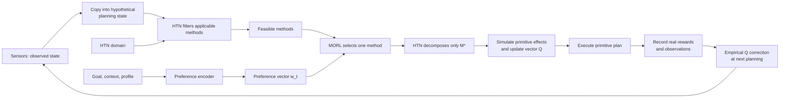
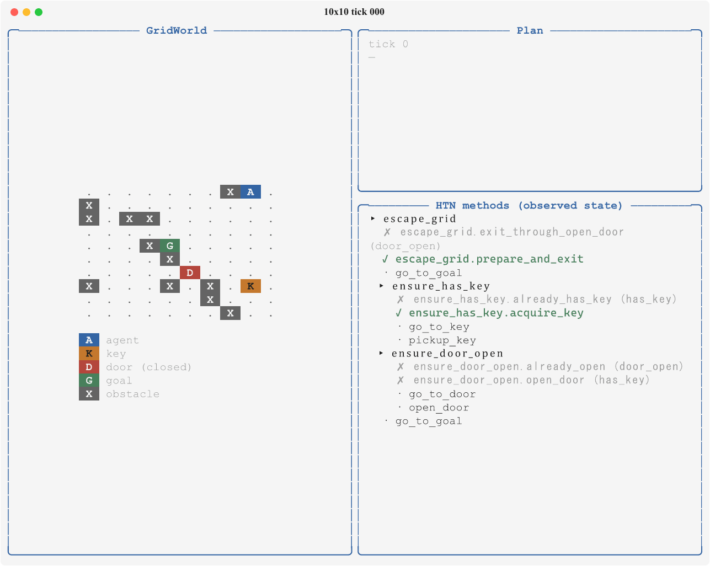
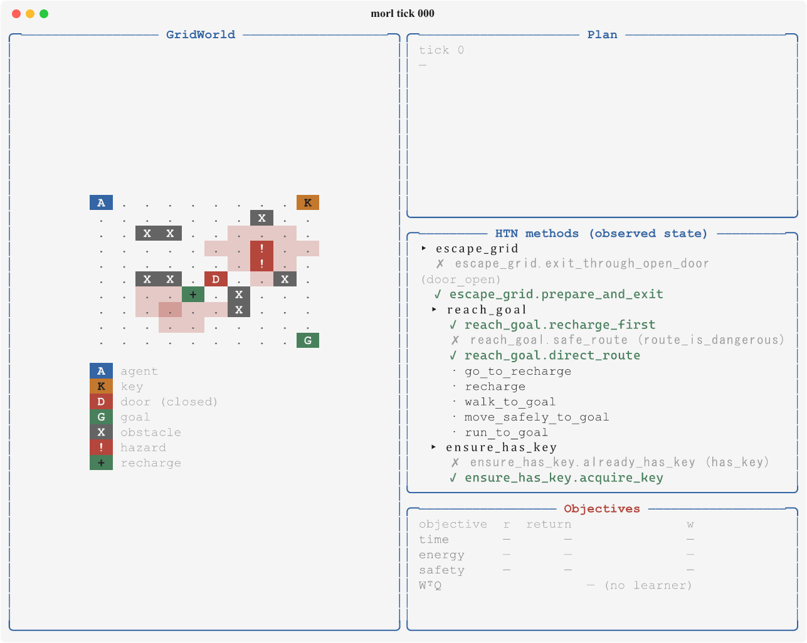

# HTN-MORL-Planner

[](https://www.repostatus.org/#active)
[](https://www.python.org/downloads/)
[](https://pre-commit.com/)
[](https://github.com/psf/black)
[](https://docs.astral.sh/ruff/)
[](https://mypy-lang.org/)
[](https://docs.pytest.org/)
[](https://squidfunk.github.io/mkdocs-material/)
[](https://www.latex-project.org/)
[](https://gymnasium.farama.org/)
[](docs/architecture/symbolic-morl.md)

Research prototype for symbolic Game AI and adaptive hierarchical planning. The
repository currently provides a runnable Hierarchical Task Network (HTN)
framework and a GridWorld example. It also documents the proposed research
architecture that will use Multi-Objective Reinforcement Learning (MORL) to
select among applicable HTN methods, learn from symbolic transitions during
planning, and correct predicted values using real execution experience.

## Research direction

The central research question is how MORL can select the most appropriate
decomposition method when an HTN has more than one semantically valid option.
The responsibilities are deliberately separated:

| Component          | Responsibility                                                                                                |
|--------------------|---------------------------------------------------------------------------------------------------------------|
| HTN                | Defines tasks, methods, preconditions, effects, and hard constraints.                                         |
| Preference encoder | Produces the current preference vector $\mathbf{w}_t$ from goal, state, profile, and context.                 |
| MORL               | Evaluates only HTN-feasible methods and selects the best trade-off under $\mathbf{w}_t$.                      |
| Runtime            | Executes primitive tasks, observes outcomes through sensors, and records empirical experience for correction. |
| Learning           | Updates vector Q from predicted planning experience and subsequently from observed execution.                 |

The preference encoder is an experimental and replaceable component. Fixed
profiles and explicit rules are the baselines; a relational graph inspired by
GOAP goal--condition--effect relationships is the main structural candidate.
A deep-learning encoder is a later, conditional extension. GOAP is not a
second planner in the target architecture.



## Current implementation

The implemented baseline is symbolic. It includes:

- `WorldState`, preconditions, effects, primitive tasks, compound tasks, and methods;
- recursive HTN planning with method-level backtracking and simulated state;
- pluggable ordering of feasible methods through DFS, heuristic, and
  value-based strategies;
- multi-tick actions, an agent tick loop, plan validation, lazy replanning, and sensors;
- generic world, pathfinding, and Gymnasium integration abstractions; and
- a runnable GridWorld with BFS navigation, terminal rendering, a key, door,
  obstacles, and a goal.

Planning-time MORL learning, empirical Q correction, preference encoders, and
RL integration are not implemented; the transition-level single- and
multi-objective reward functions are available under `htn.strategy.reward`.
The runtime provides an RL strategy extension point, but its base class
does not implement a policy or a value-function contract; applications must
provide a concrete method-ordering implementation.

### Development status

| Area                                                   | Status     | Notes                                                                                      |
|--------------------------------------------------------|------------|--------------------------------------------------------------------------------------------|
| HTN domain, planning, and backtracking                 | Available  | The planner finds a valid primitive-task plan from symbolic state.                         |
| Method-selection strategies                            | Available  | DFS and heuristic strategies are executable; the RL strategy is an extension point.        |
| Sensors, agent tick loop, and replanning               | Available  | State observations update the agent; it validates the remaining plan before replanning.    |
| GridWorld, BFS navigation, and rendering               | Available  | The executable example includes keys, doors, obstacles, and a goal.                        |
| Vector rewards and multi-objective environment         | Planned    | Initial objectives: time, energy consumption, and safety exposure.                         |
| Planning learning and empirical correction             | Planned    | Linked predicted and executed method intervals; optional pretraining.                      |
| MORL direct method selection with an HTN validity mask | Planned    | Requires preference-conditioned training, a validity mask, and single-choice fallback.     |
| Preference encoders                                    | Planned    | Fixed profiles and rules precede relational-graph and conditional deep-learning variants.  |

## Examples

Two examples share one GridWorld core. They differ only where the scenarios
genuinely differ — domain, actions, sensors, and composition root — so the
planner, the renderer, and the environment machinery are written once.

### Single-objective: key, door, goal

<table>
  <tr>
    <td valign="middle">
      This example shows the implemented runtime end to end. Each tick, sensors
      translate the concrete environment into symbolic facts, the agent
      validates the plan it is holding and rebuilds it only when that plan no
      longer applies, and exactly one primitive action executes. A closed door
      makes the decomposition non-trivial: the agent must collect the key, open
      the door, and only then reach the goal.<br><br>
      The composition root uses a reproducible 10×10 layout with seed
      <code>42</code>, two fixed obstacles, ten random ones, and a closed door.
      Entity positions are resolved at <code>reset()</code>, so the same seed
      always yields the same episode. The planner filters the methods whose
      preconditions hold, explores them in declaration order, and backtracks to
      the next one when a decomposition branch fails. Navigation is a separate
      concern: a BFS route is recomputed every tick, which keeps movement
      reactive at the cost of repeating the search.<br><br>
      The right-hand panels expose what the planner is doing. The plan panel
      tracks the executing task and the queue behind it; the methods panel marks
      each method applicable or rejected and names the precondition that failed.
      Frames are exported per tick and assembled into the GIF after the run.
    </td>
    <td valign="middle" align="center" width="46%">
      
    </td>
  </tr>
</table>

### Multi-objective: time, energy, and safety

<table>
  <tr>
    <td valign="middle">
      This example keeps the key–door structure and adds the quantities the
      research measures. The agent carries energy and health, the grid holds
      hazards, rough terrain, and a recharge tile, and a threat model scores the
      perceived risk of each tile. Four movement profiles — walk, run, safe
      move, and climb — separate time from energy: running is twice as fast and
      three times as expensive, so the two objectives cannot collapse into one.
      <br><br>
      Every transition produces the reward vector
      <code>[time, energy, safety]</code> through the objectives in
      <code>htn.strategy.reward.objectives</code>. Energy is scored as
      <em>consumption</em>, not net balance: recharging restores what the agent
      has without undoing what it spent. Safety uses the risk at the end of the
      step scaled by its duration, so standing in unchanging danger keeps
      costing. The objective panel shows the step reward, the episode return,
      and the space reserved for preference weights.<br><br>
      The domain offers three competing ways to reach the goal — run directly,
      move safely, or recharge first — which is the decision point the proposed
      MORL policy is meant to learn. It does not learn it yet: see the caveat
      below.
    </td>
    <td valign="middle" align="center" width="46%">
      
    </td>
  </tr>
</table>

> [!IMPORTANT]
> **No method selection is learned yet.** Both examples use
> `DepthFirstSearchStrategy`, so a method wins because it is declared first
> among the applicable ones, not because of any multi-objective evaluation. The
> objective panel prints `WᵀQ — (no learner)` for that reason. The reward
> vector, the competing methods, and the decision traces are the groundwork for
> that policy, not the policy itself.
>
> Route search is also unweighted: BFS ignores cost and risk, so the three
> methods currently follow the **same route** and differ only in the movement
> profile used to traverse it. "Safe move" therefore avoids hazard *damage*
> rather than routing around danger.

## Quick start

Requires Python 3.12+ and [uv](https://docs.astral.sh/uv/).

```powershell
uv sync
uv run python -m htn._examples.grid_world.single_objective.main
```

Two examples share one GridWorld core. The single-objective example runs the
key–door scenario; the multi-objective example adds movement profiles, energy,
health, and a risk field, and reports the `[time, energy, safety]` reward
vector:

```powershell
uv run python -m htn._examples.grid_world.multi_objective.main
```

Both accept `--theme dissertation|eramia` to match the palette of either
manuscript, `--seed` to change the layout, and `--no-gif` to skip the animation.
The multi-objective example also accepts `--display-weights TIME ENERGY SAFETY`,
which fills the preference row of the objective panel for a figure; no learner
consumes it and no method selection depends on it.

Rendered frames and the assembled GIF are written to
`out/grid_world/<variant>/`. Run the test suite with:

```powershell
uv run pytest
```

## Documentation

The MkDocs site is the primary technical and research documentation.

```powershell
uv sync --group docs
uv run --group docs mkdocs serve
```

Open `http://127.0.0.1:8000` for the live site. To validate a static build:

```powershell
uv run --group docs mkdocs build --strict
```

Key reading paths:

- [HTN framework overview](docs/framework/overview.md)
- [Planner and agent runtime](docs/framework/planning-runtime.md)
- [GridWorld overview](docs/grid-world/overview.md)
- [MORL-guided HTN method selection](docs/architecture/symbolic-morl.md)
- [Preference-weight generation](docs/architecture/preference-weight-generation.md)
- [Learning notes and bibliography](docs/annotations/reinforcement-learning/morl.md)

## LaTeX research plan

The LaTeX manuscript and its chapters are in [`docs/latex`](docs/latex/). From
the repository root, compile it with:

```powershell
latexmk -pdf -interaction=nonstopmode -halt-on-error -outdir=docs/latex/build docs/latex/main.tex
```

The entry point is [main.tex](docs/latex/main.tex). LaTeX sources and generated
artifacts are currently ignored by Git; local documentation updates do not
change that versioning policy.

## Repository layout

```text
src/htn/                 HTN framework and executable GridWorld example
docs/framework/          Framework model, planner, runtime, and extensions
docs/grid-world/         GridWorld environment and execution documentation
docs/architecture/       Proposed symbolic--MORL architecture and encoders
docs/annotations/        Planning and reinforcement-learning study notes
docs/reference/          Glossary and consolidated bibliography
docs/latex/              Research-plan manuscript and its chapters
```

## Status

This is an active research repository. The HTN/GridWorld baseline is the
validated implementation foundation; the MORL-guided method-selection
architecture is specified and ready to be developed and evaluated through
controlled baselines and ablation studies.
