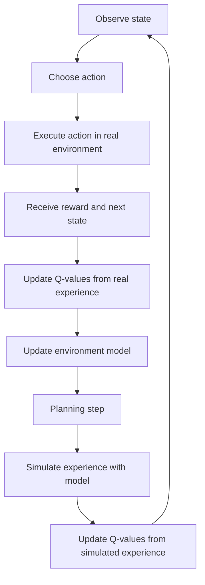

# Model-based Reinforcement Learning

In **model-based RL**, the agent learns or uses a model of the environment. The model predicts the result of an action:

```text
If I take this action in this state, what next state and reward should occur?
```

A model can be manually designed, learned from experience, or supplied by a simulator. By predicting outcomes, the agent can plan using simulated transitions as well as real interactions.

## Dyna-Q

**Dyna-Q** combines direct Q-Learning from real experience with planning through a learned model. It mixes:

- Q-Learning;
- model learning; and
- simulated experience.

After a real transition, the agent updates both Q-values and its environment model:

```text
Real experience:
  state -> action -> reward -> next state

Model entry:
  state + action -> predicted reward + predicted next state
```

It then samples earlier state-action pairs, simulates their outcomes with the model, and performs additional Q-value updates. This can improve sample efficiency when interaction with the real environment is expensive.



### Example

Suppose an agent observes an enemy while carrying ammunition, shoots, receives `+10`, and observes `enemyDamaged = true`. It updates the value of shooting and records a model transition:

```text
enemyVisible = true, hasAmmo = true, ShootEnemy
  -> reward = +10
  -> next state = enemyDamaged = true
```

Later, it can replay that modeled transition to update its Q-values without another real encounter.

## Connection to the proposed HTN learner

Here the transition model is supplied by primitive-task symbolic effects. Sensors establish $S^{obs}$, the planner copies it into $\hat S_0$, and subsequent states $\hat S_{k+1}=T_{HTN}(\hat S_k,a_k)$ are hypothetical. They are not new sensor observations and do not change the environment. Proposed method-level vector Q updates occur during decomposition using predicted rewards; execution then records empirical outcomes for correction at the next planning boundary. This is model-based or model-assisted learning, rather than purely model-free learning, but it is not an implementation of Dyna-Q's learned-model replay loop.

Separate $\alpha_{plan}$ and $\alpha_{real}$ control the model and empirical updates. Testing a larger empirical rate is reasonable; it does not by itself eliminate model bias or make paired predicted and executed experience independent. Prior training can initialize values, while learning during planning and subsequent correction remain the proposed main cycle. See the [architecture](../../architecture/symbolic-morl.md) for the full targets and duration conventions.

## Trade-offs

| Benefit                           | Cost                                            |
|-----------------------------------|-------------------------------------------------|
| Can reuse simulated experience.   | Requires an accurate enough model.              |
| Can plan before acting.           | Model errors can mislead learning and planning. |
| Often improves sample efficiency. | Maintaining a model adds complexity.            |

See [RL basics](basics.md) for core terms, or [model-free RL](model-free.md) for methods that learn values or policies without an explicit transition model.
