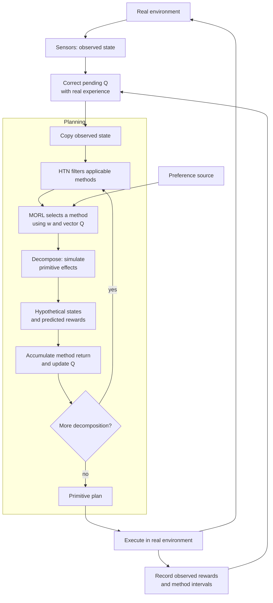
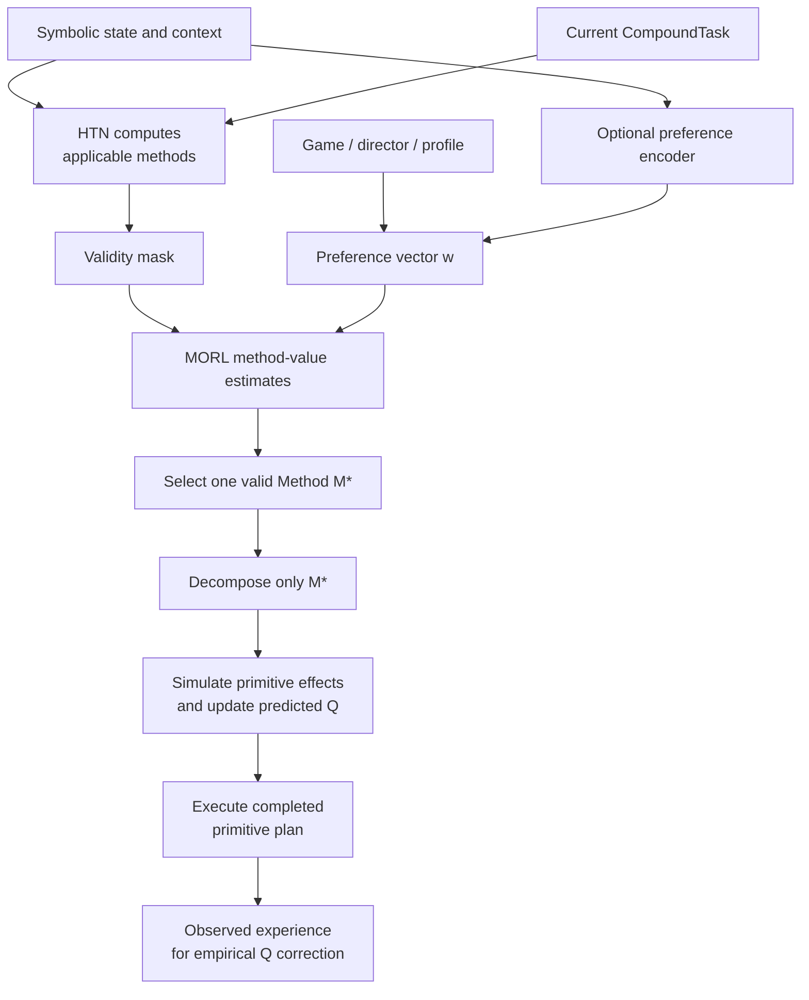
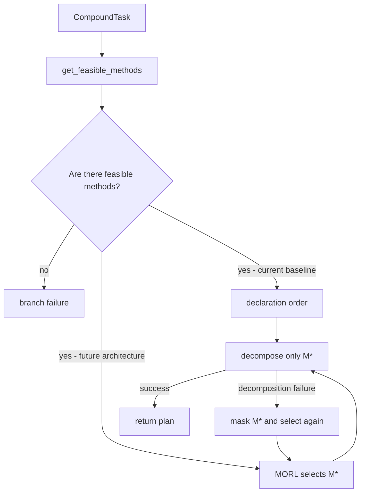

# Proposed architecture: MORL-guided HTN method selection

!!! warning "Research proposal — partially scaffolded"
    The runtime now exposes `MethodSelectionStrategy`: DFS preserves domain
    order, while the RL strategy supplies an extension point for application-
    defined ordering. Transition-level single- and multi-objective reward
    calculation is implemented under `htn.strategy.reward`; MORL training,
    preference encoders, learned-policy masking, and direct single-choice
    selection are not yet implemented.

## Problem addressed by the architecture

The `Planner` filters methods by preconditions, asks a
`MethodSelectionStrategy` to order the feasible candidates, then recursively
tries them. When a decomposition fails, it backtracks to the next candidate.
The DFS baseline retains declaration order. The heuristic strategy supplies an
executable ranking pattern, and the RL strategy defines an integration point
whose base method intentionally remains unimplemented. Neither supplies MORL
objectives or learned preferences.

The proposal adds a learned decision **only** among methods that are already applicable. Applicability is local to the symbolic model: a method can still fail during decomposition, and a symbolically valid plan can fail in the real environment. Learning preserves the planner's precondition checks.

For general definitions of rewards, returns, preferences, and Pareto trade-offs, see the [MORL learning notes](../annotations/reinforcement-learning/morl.md).

## Target architecture

### Layer responsibilities

| Layer              | Responsibility                                                                                      |
|--------------------|-----------------------------------------------------------------------------------------------------|
| HTN                | Defines tasks, methods, preconditions, effects, and the decomposition structure.                    |
| Symbolic filter    | Eliminates methods whose preconditions are not satisfied in `WorldState`.                           |
| MORL               | Selects one remaining method according to multiple objectives and preferences.                      |
| Executor           | Executes primitive tasks and observes results in the environment.                                   |
| Training           | Updates values using predicted experience during planning and empirical experience after execution. |
| Preference source  | Supplies `𝐰` from a profile, game director, rule, or optional learned encoder.                      |

## MORL for HTN method selection

The proposed architecture applies MORL at one precise point: a `CompoundTask` has more than one applicable `Method` during planning. The HTN planner first computes:

$$
\mathcal{M}_{\mathrm{valid}}(C_t, WS_t) = \left\{M \in \mathcal{M}(C_t) \mid \operatorname{preconditions}(M, WS_t)\right\}
$$

Here, $WS_t$ is the current hypothetical planning state $\hat S_t$, initialized from an observation, $C_t$ is the current compound task, $\mathcal{M}(C_t)$ is the set of methods declared for that task, $M$ is one candidate method, and $\mathcal{M}_{\mathrm{valid}}$ is the subset whose preconditions hold in that state.

Only then does MORL make one direct selection. A conceptual decision rule is:

$$
M_t^* = \underset{M \in \mathcal{M}_{\mathrm{valid}}(C_t, WS_t)}{\operatorname{arg\,max}}\; u_{\mathbf{w}_t}\!\left(\mathbf{Q}_{\theta}(C_t, WS_t, M,\mathbf{w}_t)\right)
$$

In this equation, $M_t^*$ is the selected method, $\mathbf{Q}_{\theta}(C_t,WS_t,M,\mathbf{w}_t)$ is the estimated vector value of choosing $M$ in symbolic state $WS_t$ for task $C_t$ under the current preference, and $\operatorname{arg\,max}$ returns the candidate with the highest utility under $\mathbf{w}_t$.

`Q` is a vector-valued estimate of the consequence of choosing method `M`, not an authorization to execute an arbitrary primitive action. The planner's feasible-method mask is authoritative: MORL cannot select a method excluded by symbolic preconditions. The online path does not expand or compare partial plans for every candidate: one masked inference selects $M_t^*$, and HTN decomposes only $M_t^*$.

This separation assigns two responsibilities:

- **HTN validity:** the selected method satisfies the domain's hard symbolic conditions.
- **MORL adaptation:** among valid methods, the choice reflects the current objective trade-off.

The target normal flow completes the primitive plan before execution. The current
`Planner.build_plan` can instead return a successfully planned prefix when a
later root task fails; this update does not change that implementation.

## State changes and rewards

The symbolic state `WS` contains relevant facts about the agent and the world. Rewards evaluate interaction outcomes according to the objectives defined for the experiment. When successive states contain enough information to determine this signal, we can write:

$$
\mathbf{r}_t = f(WS_t, WS_{t+1}).
$$

This notation allows state comparisons without requiring an explicit delta.

- **Numerical variables:** $\Delta x_t=x_{t+1}-x_t$.
- **World state:** $\Delta WS_t$ denotes changes in relevant variables, not general dictionary subtraction.
- **Boolean and categorical facts:** use comparisons appropriate to their types.
- **Delta-only reward:** $\mathbf{r}_t=g(\Delta WS_t)$ assumes those changes alone determine the reward.

A reward can also occur without a change in `WS`, such as a penalty for elapsed time.

### Primitive effects and environment dynamics

A method defines a decomposition into tasks. Its primitive tasks declare symbolic effects; the method does not directly apply a separate world-state effect.

World-state changes can reflect two sources:

- **Agent actions:** movement, resource consumption, item collection, and other effects of executing primitive tasks.
- **Environment dynamics:** attacks, hazards, regeneration, elapsed time, and other events affecting the agent or world.

Rewards evaluate the outcome of this interaction, including effects the agent suffers from the environment.
They are not restricted to effects directly produced by its own actions.

### Planning versus execution

Only the initial planning state originates from sensors:

$$
\hat S_0=\operatorname{copy}(S^{obs}),\qquad
\hat S_{k+1}=T_{HTN}(\hat S_k,a_k),\qquad
\hat{\mathbf r}_k=R(\hat S_k,\hat S_{k+1}).
$$

The later $\hat S_k$ are hypothetical states produced by declared primitive
effects. Sensors do not observe them, and planning does not change the real
environment. The same objective definitions evaluate observed transitions;
predicted and observed inputs must remain distinguishable.

| Stage     | State used                             | Effects included                                                                                       |
|-----------|----------------------------------------|--------------------------------------------------------------------------------------------------------|
| Planning  | A simulated copy of `WS`               | Declared primitive effects and any environmental effects explicitly represented by the planning model. |
| Execution | Observed `WS`, updated through sensors | Actual action outcomes and environmental effects captured by the observations.                         |

This gives two distinct quantities:

$$
\Delta WS_{\mathrm{predicted}}
\qquad\text{and}\qquad
\Delta WS_{\mathrm{observed}}.
$$

- **Predicted changes** describe what the model expects to happen.
- **Observed changes** describe what happened and was captured in `WS`.
- Failed actions, external events, or an incomplete model can make them differ.

The current planner applies declared primitive-task effects to a state copy.
Predicting additional environmental effects requires explicitly modeling them; it is not an existing general environment simulator.
At runtime, concrete actions change the environment and sensors refresh the symbolic state.

### Example: crossing a hazardous area

1. A method decomposes the crossing into primitive tasks.
2. During planning, the model can predict energy consumption and health loss **if both effects are modeled**.
3. During execution, movement consumes energy and the hazard may cause actual damage.
4. Sensors update the observed state with the available facts.
5. The proposed vector records time cost, energy consumption, and safety exposure.
6. Planning learns from predicted signals; observed signals subsequently correct the method value under the same credit-assignment protocol.

The method can therefore learn a lower value for exposing the agent to danger even when its primitive tasks do not declare health loss as a direct symbolic effect.
This learns the consequences of interaction; it does not establish that every external event was caused by the method.

### Using predicted and observed changes

- Use predicted changes to construct model-generated rewards and update Q during planning.
- Use observed changes to construct rewards from executed experience.
- Label simulated transitions as model-generated experience, including branches that are never executed.
- Do not count both the predicted effect and its observed realization as two separate outcomes of the same execution.

This distinction does not require expanding all candidate methods during online MORL selection.
The proposed normal path still selects one applicable method and decomposes that choice.

### Net change versus consumption

Choose the signal that matches the objective:

| Objective                   | Reward                  | Meaning                                       |
|-----------------------------|-------------------------|-----------------------------------------------|
| Improve net energy balance  | $E_{t+1}-E_t$           | Penalize net loss and reward recovery.        |
| Minimize energy consumption | $-c_t$, with $c_t\geq0$ | Penalize the energy consumed during the step. |

Consumption and recovery can cancel out in the delta.
Similarly, losing five health points and recovering five produces zero net change despite the damage received.

When symbolic states do not preserve the necessary events, the environment should provide those signals directly, such as damage received, resources consumed, or mission completion. The formulation $f(WS_t,WS_{t+1})$ is therefore one possible representation, not an architectural requirement. Observed changes may also include events external to the agent; they do not, by themselves, establish that the method caused the entire outcome.

### Task reward versus shaping

Defining a reward from a transition does not automatically constitute *reward shaping*.

- **Task reward:** defines the objective being optimized.
- **Shaping:** adds an auxiliary signal to the task reward and should be identified separately.

Even when rewards come directly from the environment, choosing objectives and scales remains part of the experimental design.

During execution, per-step signals are accumulated over the decision interval, as described in the credit-assignment section below.
Comparing only the initial and final states of the decomposition may lose intermediate events.

| Symbol                        | Role                                         |
|-------------------------------|----------------------------------------------|
| $\Delta WS$                   | Observed state changes.                      |
| $\mathbf r_t$                 | Per-objective feedback.                      |
| $\mathbf R_{\mathrm{method}}$ | Accumulated signals for the method decision. |
| $\mathbf Q$                   | Expected return including continuation.      |
| $\mathbf w$                   | Preferences used to evaluate vector values.  |

Weights do not redefine the observed rewards.

### Alternative objective: using state deltas as the reward vector

State deltas can explicitly define the reward vector when net changes represent the intended objectives. For example, select health $H$, energy $E$, and elapsed time $T$ from `WS`:

$$
\mathbf r_t=[H_{t+1}-H_t,\ E_{t+1}-E_t,\ -(T_{t+1}-T_t)]^{\mathsf T}.
$$

This definition:

- Rewards health and energy recovery.
- Penalizes health and energy loss.
- Penalizes elapsed time.

It is a valid task-reward definition, not automatically reward shaping.
It optimizes **net changes**: if consumption and recovery cancel, their net contribution is zero.

Without discounting, accumulated deltas telescope:

$$
\sum_{t=0}^{N-1}(H_{t+1}-H_t)=H_N-H_0.
$$

With discounting, the timing of changes also affects return.

### Proposed GridWorld objectives

Use a stable component order throughout rewards, Q, weights, logs, and tooltips:

$$
\mathbf r=[r_{time},r_{energy},r_{safety}]^{\mathsf T},\qquad
r_{time}=-\Delta t,\qquad r_{energy}=-c_E.
$$

Here $c_E\geq0$ measures consumption, not net energy loss. Recovery changes
available energy but is not a positive consumption reward. An alternative
net-balance objective must be named explicitly. Episode time belongs to each
environment instance; planning carries a copied predicted clock, never a global
singleton or the real environment's advancing clock.

Illustrative domain parameters, not current action implementations:

| Action    | Elapsed time | Energy consumed |
|-----------|-------------:|----------------:|
| Walk      |            1 |               1 |
| Run       |          0.5 |               3 |
| Safe move |            2 |               1 |
| Climb     |            2 |               4 |

Time and energy are thus distinct objectives. For safety, a proposed threat
score uses perceived enemies, their types and distances, and agent health:

$$
\operatorname{Risk}(S)=
\left(\sum_{e\in E(S)}\operatorname{Threat}(type_e)e^{-\lambda d_e}\right)
\left[1+\alpha_v\left(1-\frac{health}{health_{max}}\right)\right].
$$

Assume nonnegative threat weights, $\lambda>0$, $\alpha_v\geq0$, and health
bounded by a positive maximum. Empty perceived enemy sets yield zero perceived
enemy risk, not proof of safety under partial observability. Static GridWorld
hazards need their own domain-specific risk contribution.

For equal-duration steps, use $r_{safety}=-\operatorname{Risk}(S')$.
For variable-duration actions, the proposed exposure cost is
$r_{safety}=-\operatorname{Risk}(S')\Delta t$, an endpoint approximation to
integrated risk. Intermediate observations improve that approximation. Constant
danger remains costly, whereas $-\Delta Risk$ would be zero. Energy enters
safety only if the domain explicitly models low energy as vulnerability;
otherwise it remains a separate consumption objective.

These are task objectives. Auxiliary potential-based shaping has the distinct
form $F(s,s')=\gamma\Phi(s')-\Phi(s)$ in the primitive-step convention, added
to a base reward. A state delta is not automatically shaping, and arbitrary
distance bonuses should not be called potential-based shaping.

### Preference weights

The preference vector determines how relevant each component is:

$$
\mathbf w_t\in[0,1]^d,\qquad\sum_i w_{i,t}=1,\qquad
u_t=\mathbf w_t^{\mathsf T}\mathbf r_t=\sum_i w_{i,t}r_{i,t}.
$$

For the proposed order `[time, energy, safety]`:

| Weights           | Interpretation                                        |
|-------------------|-------------------------------------------------------|
| `[0.7, 0.2, 0.1]` | Prioritize time while retaining energy and safety.    |
| `[1, 0, 0]`       | Consider time alone: a **one-hot** preference vector. |

Intermediate weights allow mixed preferences.

**Worked example:**

$$
\mathbf r_t=[-2,-3,-1]^{\mathsf T},\qquad
\mathbf w_t=[0.7,0.2,0.1]^{\mathsf T}
$$

$$
u_t=0.7(-2)+0.2(-3)+0.1(-1)=-2.1.
$$

- **Signs:** define whether an increase is desirable for each component.
- **Scales:** document and, where needed, normalize component magnitudes so that they do not obscure the intended priorities.

**Rewards express outcomes; weights express priorities.**
The dot product returns a scalar, rather than an elementwise weighted vector.

### Weighting rewards versus values

- $\mathbf w_j^{\mathsf T}\mathbf R_{\mathrm{method}}$: evaluates the accumulated interval reward under the preference at selection.
- $\mathbf w_j^{\mathsf T}\mathbf Q$: evaluates expected return including continuation.

If preferences change within an interval, distinguish two criteria:

1. Weight each step with its own $\mathbf w_t$.
2. Weight the entire interval with the selection preference $\mathbf w_j$.

These are different objectives; the experiment must specify which is used.

## Intuition behind the learning cycle

The HTN domain supplies a symbolic transition model. MORL learns predicted
consequences during planning, and empirical experience subsequently corrects
those estimates. This is a model-assisted learning proposal; symbolic simulation
alone does not establish accuracy in the real environment.

The conceptual cycle is:

1. **Observe and correct:** sensors refresh the observed state; finish any pending empirical update when its continuation context is available.
2. **Copy and filter:** initialize a planning-state copy and identify applicable methods at each decomposition point.
3. **Select and simulate:** MORL selects a method; HTN decomposes it and applies primitive effects to hypothetical states.
4. **Learn during planning:** evaluate predicted vector rewards and update method values when the modeled interval is available.
5. **Execute and record:** execute the primitive plan, retain intermediate observations and rewards, and associate the realized interval with its planned decision.

Pre-deployment training may initialize values, but it is not the exclusive
learning phase. The proposed runtime includes planning updates and empirical
correction. One masked selection does not require enumerating every candidate's
plan, although decomposition, learning, and correction all contribute to latency.

The shorthand $\mathbf Q(S,M)$ suppresses task, hierarchical continuation,
policy, and preference context. Formally, vector Q estimates expected return
under a specified continuation policy; storing a vector does not make that
policy independent of preferences. Reward, interval return, and Q remain
different quantities.

“Propagating backward” means assigning credit to earlier choices from their observed consequences. A temporal update alone does not specify how credit is distributed between parent methods and the methods selected for their compound subtasks. That requires explicit decision boundaries, hierarchical context, and a credit-assignment protocol; it does not mean mechanically copying the same reward to every ancestor.

In this interpretation, $\Delta WS$ is an observed state change, reward evaluates outcomes according to objectives, and $Q$ estimates the value of a choice including future consequences. This intuition motivates the architecture without imposing reward shaping or replacing its formal specification.

## Preferences and context change

The preference vector $\mathbf{w}_t$ describes what matters now. It may change because an ally becomes vulnerable, resources become scarce, or a game-design profile changes. This differs from changing environment dynamics: preferences can change even when transition dynamics are stationary.

Preference generation is deliberately separate from MORL method selection. Fixed profiles and explicit rules are interpretable baselines. A relational graph encoder or deep-learning encoder may infer $\mathbf{w}_t$ from state and context, but it must use the same HTN mask and MORL interface as every other encoder. See [preference-weight generation](preference-weight-generation.md).

## Learning transition and credit assignment

Method selection is temporally extended. A transition starts when MORL selects a valid method. The experimental protocol must choose its endpoint: the next method-selection point, decomposition completion, replanning, or episode termination. These boundaries are alternatives to specify, not interchangeable definitions. The method-level reward is the discounted accumulation of primitive-step rewards during that interval:

$$
\mathbf{R}_{\mathrm{method}} = \sum_{i=0}^{k-1}\gamma^i\mathbf{r}_{t+i}
$$

Here, $\mathbf{R}_{\mathrm{method}}$ is the vector return assigned to one method-selection decision, $i$ indexes primitive steps after selection, $k$ is the number of executed primitive steps before control returns, and $\gamma \in [0,1]$ is the discount factor.

This is a semi-MDP-style transition. It avoids assigning all credit to one primitive action when the learned decision was instead a hierarchical decomposition choice. The same temporal boundary connects the design to [RL with Options](../annotations/reinforcement-learning/rl-with-options.md).

### Predicted update and empirical correction

For the method-completion interpretation, retain the method invocation and its
primitive span. Nested decisions require their own invocation context: do not
use the next recursive child selection as if the parent had already completed.
Interrupted execution records its actual endpoint and duration, without
fabricating a successful completion. Terminal endpoints have zero continuation;
replanning endpoints need the newly observed hierarchical continuation context.

Let $x$ include symbolic state, current task, and hierarchical context. In the
following equations $\mathbf Q(x,M;\mathbf w)$ also depends on the chosen
continuation policy. Write $\hat k$ and $k_{real}$ for primitive-step counts:

$$
\hat{\mathbf R}_M=\sum_{i=0}^{\hat k-1}\gamma^i\hat{\mathbf r}_i,
\qquad
\mathbf R_M^{real}=\sum_{i=0}^{k_{real}-1}\gamma^i\mathbf r_i^{real}.
$$

#### Planned update

$$
\begin{aligned}
\mathbf Y_{plan} &= \hat{\mathbf R}_M +
  \gamma^{\hat k}\mathbf Q(\hat x',\hat M';\mathbf w'),
\\[0.5em]
\mathbf Q(x,M;\mathbf w) &\leftarrow \mathbf Q(x,M;\mathbf w) +
  \alpha_{plan}\left[\mathbf Y_{plan} - \mathbf Q(x,M;\mathbf w)\right].
\end{aligned}
$$

#### Empirical correction

$$
\begin{aligned}
\mathbf Y_{real} &= \mathbf R_M^{real} +
  \gamma^{k_{real}}\mathbf Q(x'_{real},M'_{real};\mathbf w'_{real}),
\\[0.5em]
\mathbf Q(x,M;\mathbf w) &\leftarrow \mathbf Q(x,M;\mathbf w) +
  \alpha_{real}\left[\mathbf Y_{real} - \mathbf Q(x,M;\mathbf w)\right].
\end{aligned}
$$

The planned update uses model-generated primitive transitions; the empirical
correction uses the corresponding observed interval after execution. For a
terminal interval, the bootstrap term is zero. The two updates are linked by
decision identity and provenance, not treated as two independent executions.

For each target, choose its continuation method from the corresponding HTN
applicable set using $\arg\max_{M'}\mathbf w'^{\mathsf T}\mathbf Q(x',M';\mathbf w')$.
Take the vector of that single method, not independent maxima per objective.
The two targets can have different states, methods, preferences, and durations.
The empirical update uses the current estimate after earlier updates; it does
not simply add a reward residual to Q.

These equations discount by primitive steps. If discounting by elapsed time
$\tau$ is desired, replace each reward exponent $i$ by its elapsed offset and
each bootstrap exponent $k$ by the interval's total elapsed time $\tau$.
Do not use a fractional action duration as the upper bound of a discrete sum.
The reward $-\Delta t$ measures time cost under either discount convention.

The executor stores real experience; the next planning cycle can finish the
update after sensors and HTN supply its endpoint context. A completed terminal
interval needs no next-method lookup. Start/end states alone cannot recover
intermediate exposure, damage, or energy consumption, so preserve per-step
signals and boundaries. If reality diverges, never identify a hypothetical
start state with an observed start state merely because both belong to the
same plan; update the realized decision context and record the mismatch.

Pair predicted and executed records by decision invocation, keeping their
provenance. The diagnostic
$\vec\epsilon_M=\mathbf R_M^{real}-\hat{\mathbf R}_M$
compares interval returns; when interruption changes the endpoint, label that
comparison separately from a matched completed interval. It does not capture
all bootstrap or transition error. Two updates are not two independent real
executions. Choosing $\alpha_{real}>\alpha_{plan}$ is an experimental option,
not a guarantee against model bias: update counts, model accuracy, and sampling
also matter.

See the [proposed interfaces](../framework/extensions.md).

## Current strategy interface and proposed MORL integration

Today, `CompoundTask.get_feasible_methods(world_state)` returns applicable
methods, and the planner passes them to `strategy.order_methods(methods,
world_state)`. `RLBasedSearchStrategy` retains an RL-agent reference, but its
base ordering method raises `NotImplementedError`; a concrete subclass must
define the policy or value-function interface. It still relies on ordinary
planner backtracking.

The proposed evolution is to select one method directly at each HTN decision
point. The policy receives the feasible-method mask, evaluates the alternatives
in one inference, and decomposes only the selected method in the normal online
path:

This is not a depth-first search over a MORL-ranked list. During normal operation, the loop runs once: filter, infer, select $M^*$, and decompose $M^*$. If that decomposition fails, the planner temporarily masks $M^*$ and invokes the same MORL selector over the remaining candidates. This **method fallback** is failure recovery, not the expected decision path.

Three cases remain deliberately separate:

1. A method with unsatisfied preconditions is excluded before MORL and never needs fallback.
2. A locally valid method whose subtasks cannot be decomposed triggers method fallback at the same `CompoundTask`.
3. A world change during primitive execution invalidates the current plan and triggers replanning from the current `WorldState`, rather than backtracking over an obsolete planning state.

When state, hierarchical context, preferences, and the value-function version
have not changed, the implementation may reuse the values from the first
inference, mask the failed method, and take a new `argmax`. A planning update
that changes Q also invalidates those cached values.

## Experimental questions

### Main learned baseline: scalar Deep RL

The evaluation will compare preference-conditioned MORL against a scalar Deep RL baseline for HTN method selection based on **Bahrami (2025)**, discussed in the [bibliography](../reference/bibliography.md).
Implementation details and any adaptations to the experimental domain will be documented explicitly.

| Approach                             | Learning objective                                                              |
|--------------------------------------|---------------------------------------------------------------------------------|
| Scalar Deep RL baseline              | Estimate scalar method values under a declared reward scalarization.            |
| Proposed preference-conditioned MORL | Estimate vector method values and select according to the supplied preferences. |

MORL may also use deep neural networks. The comparison concerns scalar learning versus preference-conditioned multi-objective learning, rather than shallow versus deep models.

For a controlled comparison:

- Use the same HTN domain, applicability rules, observations, and evaluation scenarios.
- Define the scalar baseline's reward weights and report whether separate models are trained for different preferences.
- Report both per-model and total training budgets, along with comparable tuning budgets and model capacity where feasible.
- Evaluate task performance, utility, generalization to held-out preferences, adaptation after preference changes, and computational cost.
- Distinguish an adaptation of the published approach from an exact reproduction.

### Additional baselines and ablations

The evaluation will retain symbolic baselines and distinguish the following effects:

| Comparison                                                | Isolates                                                     |
|-----------------------------------------------------------|--------------------------------------------------------------|
| Fixed HTN order vs. MORL with fixed $\mathbf{w}$          | Learned direct selection among valid methods.                |
| Fixed $\mathbf{w}$ vs. dynamic rule-based $\mathbf{w}_t$  | Adaptation to changing preferences.                          |
| Rules vs. graph/deep encoder                              | Value of structured or learned preference inference.         |
| MORL with and without HTN mask in a safe test setting     | Value of symbolic validity filtering.                        |
| Planning-only vs. real-only vs. combined updates          | Contribution of modeled experience and empirical correction. |
| Accurate vs. deliberately incomplete symbolic model       | Sensitivity to model error under controlled scenarios.       |

Useful metrics include vector return, utility under held-out preferences, task success, invalid-method selection rate, decomposition-fallback rate, adaptation latency, method-switch stability, and normal-path planning-time latency.

Also report per-objective predicted/real return error, state and duration
mismatch, interruption rate, and separate planning/empirical update counts and
wall-clock costs. Normalize components before combining error magnitudes;
compare ablations under declared interaction and computational budgets.

## Technical roadmap

1. **HTN strategy baseline — available:** DFS and heuristic ordering can be instrumented now; the RL ordering hook is ready for a concrete implementation and the same instrumentation.
2. **Multi-objective environment — future:** define the components of `r` and how each episode records returns.
3. **HTN–MORL integration — future:** introduce a preference-conditioned, single-choice selector for feasible methods, plus MORL-guided method fallback after decomposition failure.
4. **Learning — future:** update vector values from symbolic planning experience and correct them from execution; evaluate optional pretraining and separate model/empirical update budgets.
5. **Preference sources — experimental track:** compare game/director inputs, fixed profiles, rules, relational graphs, and deep learning under the same MORL interface.
6. **Experimental comparison — future:** compare MORL with the scalar Deep RL baseline based on Bahrami (2025), alongside symbolic baselines and ablations; report plan validity, fallback rate, replanning, vector return, preference adaptation, and decision cost.

## Implications for GridWorld

The current GridWorld is a good initial environment because it already has high-level alternatives: when the door is closed, the domain must ensure it has a key, open the door, and reach the goal. To experiment with MORL in practice, it will be necessary to add genuinely competing alternatives and rewards with more than one objective; in the current domain, method order is mainly a fixed execution rule.

The next proposed milestone is Resource Delivery GridWorld, adding inventory,
resource delivery, recharge, and direct/safe/shortcut alternatives, followed by
partial observability and a reduced Crafter domain. The
[experimental progression](../grid-world/overview.md#proposed-experimental-progression)
also describes future cell/method tooltips for inspecting Q, preferences, and
prediction error. None of these extensions is implied by the current baseline.

See the [preference-weight generation](preference-weight-generation.md), [planner and agent guide](../framework/planning-runtime.md), and [domain, actions, and navigation](../grid-world/domain-and-actions.md).
