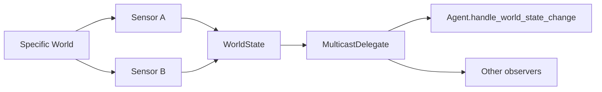

# Extensions and integrations

## Actions

Every concrete action inherits from `Action` and implements:

```python
def execute(self, world: World) -> ActionStatus:
    ...
```

An action must change the concrete world, not `WorldState` directly. Return `RUNNING` for multi-tick operations, `SUCCESS` when it reaches its goal, and `FAILURE` for an unrecoverable condition.

## Sensors and events

`Sensor[WorldT]` converts concrete data into symbolic facts through `sense(world, world_state)`. `SensorSystem` maintains a sensor list, calls each one in `update()`, and then triggers `on_world_state_changed`.



`MulticastDelegate` allows handlers to be added and removed, as well as invoked together. This decouples the observation source from event consumers.

## World and Gymnasium

`World` is the abstract context shared by actions and contains `world_state` and `agent`. `GymWorld` adds `env`, `last_obs`, `last_reward`, and `done`; subclasses must implement `update_from_obs(obs)` when using this generic adaptation.

In GridWorld, the `GridWorld` adapter class exposes the specific environment and delegates the `done` property to `env.done`.

## Pathfinder

The generic contract is `Pathfinder[NodeT, ContextT]`:

```python
def find_path(self, start: NodeT, goal: NodeT, context: ContextT) -> list[NodeT]:
    ...
```

It makes no assumptions about graphs, grids, or algorithms. An integration can provide A*, Dijkstra, or navmesh navigation, as long as the action interprets a node list. GridWorld uses `NodeT = tuple[int, int]`, `ContextT = GridContext`, and BFS.

## Checklist for a new environment

1. Define the concrete environment and a representation of positions or resources.
2. Create a `World` adapter for actions.
3. Write sensors that update every fact used by the domain.
4. Implement `Action`s, including their status contract.
5. Model `PrimitiveTask`s with coherent symbolic preconditions and effects.
6. Decompose goals into `CompoundTask`/`Method`.
7. Assemble `Domain`, `Planner`, `Agent`, `SensorSystem`, and the tick loop.

## Reward and experience contracts

The transition-level reward classes are implemented in
[`htn.strategy.reward`](reward.md). They define reward composition while each
domain supplies the semantics of its objectives. Preferences belong to the
MORL/Q-value layer, not to the reward function: `calculate` returns the
immediate `r` used later with discount factors and preference weights.

```python
class RewardFunction:
    def calculate(self, previous_state, current_state) -> Vector: ...

class RewardObjective:
    def calculate(self, previous_state, current_state) -> float: ...

class MultiObjectiveRewardFunction(RewardFunction):
    def __init__(self, objectives):
        self.objectives = objectives

    def calculate(self, previous_state, current_state):
        return vector([
            objective.calculate(previous_state, current_state)
            for objective in self.objectives
        ])

class EpisodeClock:
    elapsed_time: float  # owned and reset by one environment/episode

class PlannedTransition:
    decision_id: object
    task: object
    state: object
    method: object
    predicted_next_state: object
    predicted_reward: Vector  # accumulated method return
    predicted_duration: float

class ExecutedTransition:
    decision_id: object  # links to the predicted method decision
    task: object
    state: object
    method: object
    actual_next_state: object
    actual_reward: Vector  # accumulated observed method return
    actual_duration: float
```

The `RewardObjective` and `RewardFunction` portions of the pseudocode above
summarize the implemented reward contracts. `EpisodeClock`,
`PlannedTransition`, and `ExecutedTransition` remain proposed integration
contracts and are not currently provided by the package.

These signatures assume the state snapshots expose the quantities needed by the objectives, including elapsed episode time and cumulative energy consumption. A change in state is evidence for reward calculation, not automatically the reward itself. The clock must be per episode, not a global singleton; hypothetical planning clocks advance independently of the live episode clock.

Experience records must retain the decision's preference/policy context, termination or interruption status, and primitive trace alongside the illustrated fields. Pair records by decision identity rather than by state equality. Planned branches that are abandoned have no executed counterpart, and an interrupted prefix must not be reported as a completed method. A pending empirical update is resolved at the next planning boundary using its observed end state, actual duration, and next feasible methods; terminal returns need no bootstrap.

Accumulate primitive rewards once within each method's defined interval. A parent return may cover the same primitive trace as a child, but must not add the child's accumulated return to those same primitive rewards. Likewise, predicted and observed records are linked model evidence and empirical correction, not two equivalent independent samples. Different learning rates are an experimental choice, not a guarantee of removing model bias.

When moving from GridWorld to Resource Delivery GridWorld and then Crafter, replace the environment, sensors, actions, HTN domain, and reward implementations. The intended reusable layer is the planner, method-selection strategy, MORL learner, Q representation, preference handling, and these reward abstractions.
