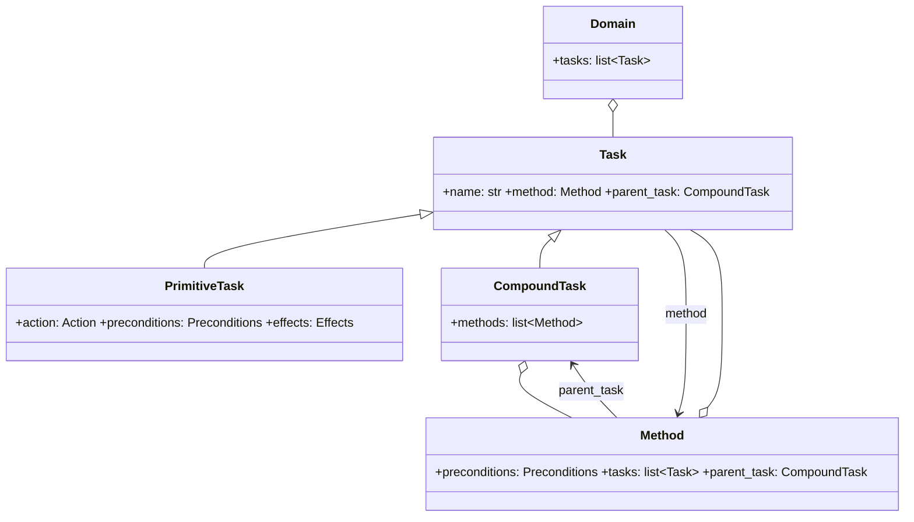

# Domain and state model

## `WorldState`: symbolic memory

`WorldState` is a mutable dictionary of facts: `dict[str, WorldValue]`, where `WorldValue` can be `bool`, `int`, `float`, or `str`.

```python
world_state.set_state("has_key", True)
world_state.set_state("energy", 10)
```

`copy()` produces a shallow copy of the fact map. This operation isolates planning simulation from the state observed at runtime.

## Tasks and methods



- **`PrimitiveTask`** is a leaf: it checks conditions, simulates effects, and wraps an executable `Action`.
- **`CompoundTask`** represents a high-level intent and lists alternative decompositions (`Method`).
- **`Method`** declares its own preconditions and an ordered list of subtasks. An empty list is a valid decomposition, useful for a *no-op* branch.
- **`Domain`** contains the root tasks, evaluated by the `Planner` in declaration order.

## Ownership and back-references

A domain declares tasks once and reuses them across methods. `walk_to_goal` may
appear in several decompositions, and `reach_goal` may be a subtask of more than
one method. Each occurrence needs its own place in the hierarchy, so `Method`
and `CompoundTask` deep-copy what they receive and wire the copies:

```python
method = Method(id="reach_goal.direct", name="Direct", preconditions={}, tasks=[walk_to_goal])
compound = CompoundTask(name="reach_goal", methods=[method])

compound.methods[0] is method              # False: the tree holds a copy
compound.methods[0].tasks[0].method        # the copied method
compound.methods[0].tasks[0].parent_task   # compound
walk_to_goal.method                        # None: the declared task stays a template
```

Two consequences follow. Every node in the tree has exactly one parent, so the
chain from a task back to its root is unambiguous — which is what lets the
planner and the agent attribute a plan step to the decision that produced it.
And the objects a domain builder declares are never mutated: they remain
templates, so a task placed in two methods yields two independent instances.

`Task.parent_task` is derived, not stored: it reads `method.parent_task`, so the
two levels of the hierarchy cannot drift apart. A root task has no method, and
its `parent_task` is `None`.

## Method-selection strategies

After `CompoundTask.get_feasible_methods(world_state)` filters methods by
preconditions, the planner delegates their exploration order to a
`MethodSelectionStrategy`. The strategy does not bypass HTN validation: the
planner recursively decomposes each ordered candidate and backtracks when a
branch fails.

| Strategy                       | Ordering rule                                                                     | Intended use                                                    |
|--------------------------------|-----------------------------------------------------------------------------------|-----------------------------------------------------------------|
| `DepthFirstSearchStrategy`     | Keeps domain declaration order.                                                   | Deterministic baseline and examples.                            |
| `HeuristicBasedSearchStrategy` | Sorts by an application-defined lower-is-better score.                            | Hand-crafted cost, risk, or distance heuristics.                |
| `RLBasedSearchStrategy`        | Abstract RL-specific ordering hook; the base method raises `NotImplementedError`. | Subclass with an application-defined policy or value interface. |

The RL strategy is an integration point, not a complete MORL implementation.
It stores the agent reference but deliberately leaves the policy or
value-function interface unspecified. A subclass must implement ordering.
The RL strategy does not create rewards, preferences, training, or a
feasible-method mask. Transition-level reward calculation is provided
separately by [`htn.strategy.reward`](reward.md).

## Preconditions

```python
preconditions = {
    "has_key": ("=", True),
    "energy": (">=", 5),
}
```

The `Preconditions` type is `dict[str, tuple[ConditionOperator, WorldValue]]`. Supported operators are `=`, `!=`, `>`, `<`, `>=`, and `<=`.

A missing key causes the check to fail. Ordering comparisons require numeric values; invalid use raises `ValueError`. This makes a domain explicit: it does not silently treat missing information as false in comparisons.

## Effects

```python
effects = {
    "door_open": ("=", True),
    "energy": ("-", 2),
}
```

`Effects` uses the form `dict[str, tuple[EffectOperator, WorldValue]]`. Supported operators are `=`, `+`, `-`, `*`, `/`, `%`, `//`, `**`, and `not`.

| Category   | Requirement                                            |
|------------|--------------------------------------------------------|
| `=`        | replaces the value, including for a new key            |
| arithmetic | the key must exist and values must be numeric          |
| `not`      | the current value must be boolean                      |

Effects are predicted by the planner; operational confirmation comes from sensors after the real action.

## Minimal domain example

```python
unlock = PrimitiveTask(
    name="unlock",
    action=UnlockAction(),
    preconditions={"has_key": ("=", True), "door_open": ("=", False)},
    effects={"door_open": ("=", True)},
)

enter = CompoundTask(
    name="enter_room",
    methods=[
        Method(
            id="enter_room.through_open_door",
            name="Enter through open door",
            preconditions={"door_open": ("=", True)},
            tasks=[unlock],
        )
    ],
)

domain = Domain(tasks=[enter])
```

In practice, a method for `enter_room` should decompose into a coherent sequence, such as obtaining a key, opening the door, and passing through. The example emphasizes that the subtask order in `Method.tasks` is the planning and execution order.
