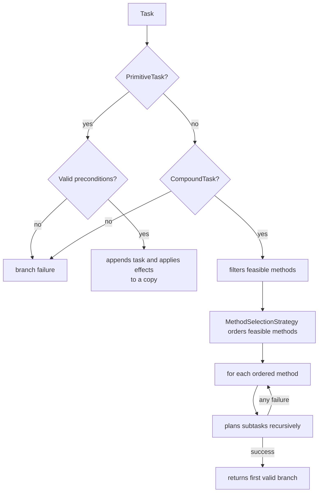
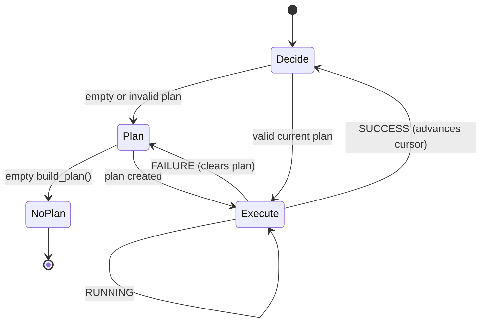

# Planner and agent

## Recursive planning and backtracking

`Planner.build_plan(tasks)` starts from a copy of `world_state_copy` and
traverses the caller-provided root tasks in order. For each task,
`recursive_planning()` returns either a `PlanningResult` or `None`. If a later
root task cannot be planned, the successfully planned prefix is returned;
`None` is returned only when no primitive task can be planned.

```python
@dataclass(frozen=True, slots=True)
class PlanningResult:
    tasks: list[Task]
    world_state: WorldState
    decompositions: list[MethodDecomposition]
```

The result is immutable and extending a branch builds a new one, so a method
that fails midway leaves the branch it started from untouched. Backtracking is
therefore a property of the type rather than a copy the planner must remember
to make.



Backtracking occurs at the method level: if any subtask in a decomposition fails, that branch copy is discarded and the next feasible method is tested. The first method that produces all subtasks is chosen.

!!! warning "Order matters"
    `DepthFirstSearchStrategy` preserves declaration order and is the default
    used by the examples. Other strategies can rank the same feasible methods,
    but the planner still tests each ranked branch and backtracks after a
    decomposition failure.

## Method ordering

Pass a `MethodSelectionStrategy` when constructing a planner. The strategy is
called only after `CompoundTask.get_feasible_methods()` has applied the hard
preconditions:

```python
from htn.strategy import DepthFirstSearchStrategy

strategy = DepthFirstSearchStrategy()
planner = Planner(domain, world_state, strategy)
```

`HeuristicBasedSearchStrategy` is an abstract base for lower-is-better
application heuristics. `RLBasedSearchStrategy` stores an RL-agent reference,
but its base `order_methods()` intentionally raises `NotImplementedError`; a
subclass defines the policy or value-function interface. Neither strategy
removes HTN backtracking or makes an infeasible method valid.

## Planner state

`update_world_state()` replaces the snapshot with an observed copy and clears `_current_plan`. `build_plan()` builds a fresh result each call; the plan being executed belongs to the `Agent`, so a sensor update does not automatically erase it.

## `Agent` state machine



Each `tick(world)` can rebuild a plan and execute one action. The `Agent`
retains a copy of its ordered root tasks and supplies that sequence for each
replanning attempt. `AgentTickResult` returns the task name, status, whether
replanning occurred, newly created plan names, the remaining plan, and an
optional message.

The agent holds the plan as an `ExecutablePlan`, which pairs the task list with
its decomposition record and tracks progress with a cursor:

```python
@dataclass(frozen=True, slots=True)
class ExecutablePlan:
    tasks: list[Task]
    decompositions: list[MethodDecomposition]
    executed_count: int = 0
```

Executed tasks stay in the list instead of being removed, because the recorded
spans index that list. `remaining_tasks` and `remaining_decompositions` expose
the pending part, rebasing each span onto it and dropping the methods already
closed. A method whose span starts behind the cursor but ends ahead of it stays
open: part of its decomposition is still pending, so it still needs to hold.

`Agent.plan` remains a read-only view of the pending tasks, so consumers that
iterate the plan are unaffected.

## Decomposition record

A plan is a flat list of primitive tasks, which alone does not say which method
produced each step. The planner records every applied method as the branch
succeeds:

```python
@dataclass(frozen=True, slots=True)
class MethodDecomposition:
    method: Method
    compound_task: CompoundTask
    start_index: int
    end_index: int
    depth: int
```

`start_index` and `end_index` delimit the plan span the method produced. A
method whose decomposition is empty yields `start_index == end_index`, which
keeps a no-op branch visible in the record even though it contributes no task.
`depth` preserves the nesting, so a validator can check an outer method before
the ones nested in it.

Records travel inside the branch result and are discarded together with it when
a method fails, so a plan never carries a decision that was backtracked over.

## Plan validation

A sensor update does not destroy the plan. `validate_plan()` walks the remaining
plan once, carrying a simulated state, and checks two distinct properties:

| Level | Question | Violation |
|---|---|---|
| Primitive task | Can this action still execute? | `INFEASIBLE_TASK` |
| Method | Is this decomposition still the right one? | `UNJUSTIFIED_METHOD` |

At each position the walk first checks the methods that open there, outermost
first, then the primitive task, then applies its effects to the simulated copy.
Checking methods where their compound task started decomposing — rather than
against the current observation — keeps the check faithful to the state the
planner saw when it chose that branch. The same carried state lets a later
action depend on an effect produced by an earlier one still in the plan.

The distinction matters because the two levels fail independently. In the
GridWorld domain, `reach_goal.safe_route` and `reach_goal.direct_route` expand
into navigation tasks with identical preconditions; only the method mentions
`route_is_dangerous`. Once the hazard clears, every primitive task in the plan
remains executable while the branch that justified them no longer applies.
Validating only the task level would leave the agent on the slow profile for the
rest of the episode.

`validate_plan()` returns the first violation it finds, with the plan position,
the simulated state reaching that position, and the compound task to decompose
again. A valid plan yields no violation.

## Action statuses

| Status    | Effect on the plan                                         |
|-----------|------------------------------------------------------------|
| `RUNNING` | keeps the current task for the next tick                   |
| `SUCCESS` | advances the cursor past the current task                  |
| `FAILURE` | discards the entire plan; the next tick will plan again    |

An unexpected non-primitive task is skipped and reported in a message. This is a defensive mechanism: in normal operation, the planner already returns only primitive leaves.

## Replanning condition

The agent replans when it has no plan, or when validation reports a violation.
An infeasible task forces an immediate replan, because the plan physically
cannot execute and waiting only wastes ticks. An unjustified method leaves an
executable plan, so the decision of whether to abandon it is a policy question
rather than a correctness one.

## Planned: partial replanning

Replanning currently discards the whole plan and rebuilds from the root tasks,
even when the violation affects a single subtree. The decomposition record makes
a cheaper alternative possible, and the data it needs is already produced: the
violation carries the plan position, the simulated state reaching it, and the
compound task to decompose again, whose recorded span delimits the slice to
replace.

The planned procedure re-decomposes the lowest ancestor of the violation,
splices the result into the plan, and validates the spliced plan. On failure it
climbs one level and retries. The chain is finite, so the procedure terminates,
and its last level is the root — today's full replan becomes the degenerate case
rather than a separate path.

```text
prim → method → compound → method → compound → ... → root
       └── first replan target, then one level up per failed attempt
```

Two conditions carry the correctness of the splice:

- **The boundary state, not the current one.** A subtree does not start now; it
  starts after the tasks preceding it in the plan. Re-decomposition must begin
  from the simulated state at the slice boundary.
- **Re-validate the suffix.** A new decomposition may produce different effects
  from the one it replaces, so tasks after the slice may no longer hold. Without
  this check, an invalid plan is swapped for another invalid plan and the failure
  resurfaces ticks later, far from its cause.

The procedure assumes the primitive tasks of a subtree occupy contiguous plan
positions, which follows from depth-first decomposition. Extending the planner to
partially ordered networks would break that assumption and require revisiting the
splice.

## Planned: replanning policy

`_should_replan()` delegates the unjustified-method case to a policy that
currently always accepts, so both violation kinds still behave alike.

A policy guards against the opposite waste from the one partial replanning
addresses: switching plans too often when a precondition oscillates, for example
under a noisy sensor. Two forms are planned. A persistence counter replans only
after the violation holds for a minimum number of consecutive ticks — cheap, but
with an arbitrary threshold. A gain deadband compares the vector cost of
continuing against the alternative plan and switches only when the improvement
clears a margin — the threshold stops being arbitrary, at the cost of building
the alternative plan even when it is discarded.

The policy will be an explicit extension point shaped like
`MethodSelectionStrategy`, so each variant becomes a comparable experimental
variable rather than a constant buried in the agent.

Hysteresis applies to justification only. An infeasible task cannot execute, so
delaying it wastes ticks without ever becoming feasible.
