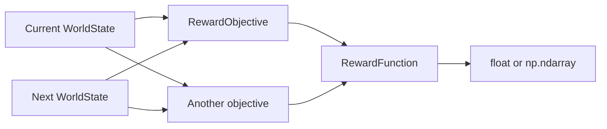

# Reward mechanism

The reward mechanism lives under `htn.strategy.reward`. It separates the
definition of an individual objective from the function that combines one or
more objectives. This makes the same state-transition semantics usable for
single-objective RL and for multi-objective RL (MORL).

## Package layout

```text
htn.strategy.reward
├── RewardObjective
├── RewardFunction[T]
└── functions
    ├── SingleObjectiveRewardFunction
    └── MultiObjectiveRewardFunction
```

The public imports are available from the reward package:

```python
from htn.strategy.reward import (
    MultiObjectiveRewardFunction,
    RewardFunction,
    RewardObjective,
    SingleObjectiveRewardFunction,
)
```

## Objective contract

`RewardObjective` is the domain-specific extension point. A concrete objective
implements `calculate(current_state, next_state)` and returns one `float` for a
single transition. Both arguments are `WorldState` snapshots; the objective
decides which facts and state delta matter.

```python
from htn.strategy.reward import RewardObjective


class EnergyObjective(RewardObjective):
    def calculate(self, current_state, next_state) -> float:
        before = current_state.get_state("energy")
        after = next_state.get_state("energy")
        return float(after - before)
```

An objective can reward improvement or penalize deterioration. The direction,
scale, normalization, and treatment of missing facts are domain decisions and
are not imposed by the framework.

## Reward functions

`RewardFunction[T]` defines the common transition-based interface:

```python
def calculate(current_state: WorldState, next_state: WorldState) -> T:
    ...
```

### Single objective

`SingleObjectiveRewardFunction` wraps one `RewardObjective` and returns its
scalar result unchanged:

```python
reward_function = SingleObjectiveRewardFunction(EnergyObjective())
reward = reward_function.calculate(previous_state, next_state)  # float
```

### Multiple objectives

`MultiObjectiveRewardFunction` receives one or more objectives and evaluates
them in constructor order. It returns a one-dimensional NumPy array with
`dtype=np.float64`; its positions therefore define the objective order:

```python
reward_function = MultiObjectiveRewardFunction(
    TimeObjective(),
    EnergyObjective(),
    SafetyObjective(),
)
reward = reward_function.calculate(previous_state, next_state)
# [time_reward, energy_reward, safety_reward]
```

Constructing it without objectives raises `ValueError`. The implementation
does not apply preference weights or reduce the vector to a scalar; preserving
the components is what allows a MORL strategy or learner to apply its own
preferences later.

## Use with Q-values and MORL

The value returned by `calculate` is the immediate reward `r` for the
transition. It is not yet a return and it is not a Q-value. The planning/RL
layer can accumulate these transition rewards into the return used by the
method-level value update.

For method-level learning, the transition rewards produced while simulating
the primitive decomposition can first be accumulated into a method return.
For a single-objective reward:

$$
R(M_t)
=
\sum_{i=0}^{k-1}\gamma^i r_{t+i}.
$$

For a multi-objective reward, the same accumulation is performed
component-wise:

$$
\mathbf{R}(M_t)
=
\sum_{i=0}^{k-1} \gamma^i \mathbf{r}_{t+i}.
$$

A method-level temporal-difference target can then be expressed generically
as:

$$
\mathbf{y}_t
=
\mathbf{R}(M_t)
+
\gamma^k(1-done_t)
\boldsymbol{\mathcal{B}}(s_{t+k}, \mathbf{w}_t),
$$

where `\boldsymbol{\mathcal{B}}` is the bootstrap term defined by the
selected RL algorithm. The reward package intentionally does not prescribe
SARSA, Q-learning, or another update rule. In this project, the learned
decision is the choice of an HTN method `M`, rather than the direct selection
of a primitive action. A single-objective learner therefore evaluates values
such as:

$$
Q(s_t, M_t).
$$

For a multi-objective reward, each `\mathbf{r}_i` is the vector produced by
`MultiObjectiveRewardFunction`, and `\mathbf{R}(M_t)` preserves those
objective components. MORL preferences apply a weight vector `w` to the
method-level vector value when the learner needs a scalar utility:

$$
U(s_t, M_t, \mathbf{w}_t)
= \mathbf{w}_t^{\mathsf T}
\mathbf{Q}(s_t, M_t; \mathbf{w}_t).
$$

The exact Q representation (one Q per objective, a preference-conditioned Q,
or another MORL algorithm) determines the bootstrap and how weights are
applied. Scalarizing the immediate reward `r` before learning is also possible
for algorithms that require it, but it is not imposed by this package. The
reward function's responsibility ends at producing each transition reward
`r_i`; it must not silently accumulate method returns or apply `\gamma` or
`\mathbf{w}`.

## Transition flow



The mechanism evaluates one transition at a time. Accumulating primitive
rewards into a method return, associating predicted and executed transitions,
applying `\gamma` and MORL weights, and handling terminal episodes belong to
the training/runtime layer that consumes this result.

## Current scope and limitations

The reward package is implemented, but it is intentionally independent from
the planner and `RLBasedSearchStrategy`. At present it does not:

- provide built-in domain objectives;
- calculate preference weights or scalarize reward vectors;
- train an RL agent or order feasible HTN methods;
- record experience or connect predicted rewards to executed rewards.

The planner still passes feasible methods to the configured method-selection
strategy, and a concrete RL strategy must define how an agent uses reward
signals and orders those methods. The reward classes provide the reusable
transition-level calculation needed by that integration.
