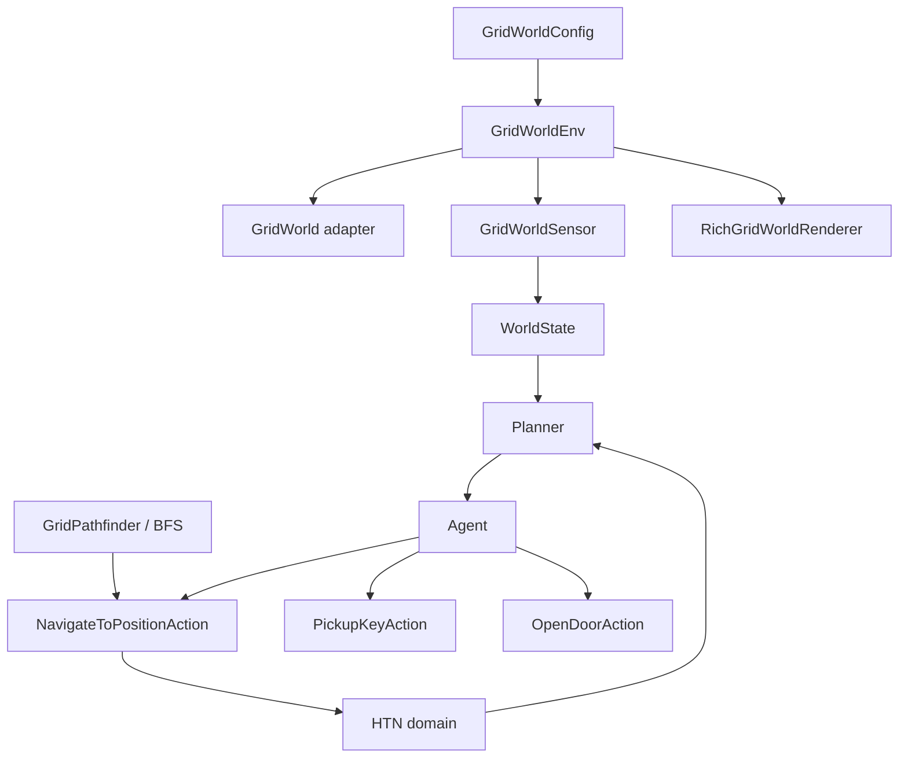

# GridWorld: overview

The `htn._examples.grid_world` package demonstrates the HTN runtime in a Gymnasium environment. The agent must reach the goal; if the door is closed, it must obtain the key and open it before final navigation.

## Goal and scenario

`GridWorldEnv` uses `(x, y)` coordinates. The default configuration is a deterministic 3×3 grid:

```text
A . K
. X .
G . D

A agent | K key | D closed door | G goal | X obstacle
```

The `main.py` script uses a different configuration: a 10×10 grid, two fixed
barriers, ten random obstacles, seed 42, and an initially closed door. It
explicitly uses `DepthFirstSearchStrategy` and copies the domain root tasks
for the agent, demonstrating the complete **key → door → goal** sequence.

## Example components



| File            | Role                                                 |
|-----------------|------------------------------------------------------|
| `env.py`        | Gymnasium configuration and environment              |
| `pathfinder.py` | Grid context and BFS                                 |
| `movement.py`   | Converts an adjacent step into an environment action |
| `actions.py`    | World adapter and concrete HTN actions               |
| `domain.py`     | Domain, tasks, methods, and symbolic effects         |
| `sensors.py`    | Facts observed by the planner                        |
| `renderer.py`   | Terminal visualization through Rich                  |
| `main.py`       | Composition root and simulation loop                 |

Continue to [environment and configuration](environment.md) or see [domain, actions, and navigation](domain-and-actions.md).

## Proposed experimental progression

The existing key–door–goal example validates runtime integration. The research roadmap extends it first into **Resource Delivery GridWorld**, with collection and delivery goals, resource limits, route choices, and threats, then into **Crafter**. These extensions and MORL learning are proposals, not features of the current environment or renderer.

The initial objective order is `[time, energy, safety]`, with larger rewards preferred. Candidate action costs deliberately separate time from energy:

| Candidate action | Elapsed time | Energy consumed |
|---|---:|---:|
| Walk | 1 | 1 |
| Run | 0.5 | 3 |
| Safe move | 2 | 1 |
| Climb | 2 | 4 |

Time reward is $r_{time}=-\Delta t$. Energy reward initially measures consumption, $r_{energy}=-\Delta E_{consumed}$, rather than net energy balance: resting or recharging can increase a balance without undoing past expenditure. If every action has identical time and energy costs, those objectives become redundant. Action count is not elapsed time when durations differ; each episode owns its clock, and planning uses a hypothetical copy.

A candidate safety model uses perceived threats and health-related vulnerability:

$$
Risk(S)=\left(\sum_{e\in E(S)}Threat(type_e)e^{-\lambda d_e}\right)
\left[1+\alpha_v\left(1-\frac{health}{health_{max}}\right)\right],
\qquad r_{safety}=-Risk(S').
$$

Here $\lambda>0$, $\alpha_v\geq0$, nonnegative threat weights, and $health_{max}>0$ are domain parameters; health stays within its valid range. Repeated exposure remains costly even when risk does not change; using only $-\Delta Risk$ would miss that exposure. The displayed reward assumes equal-duration steps. For variable-duration actions, use $-Risk(S')\Delta t$ as an endpoint approximation to exposure. No perceived enemies means zero perceived enemy risk, not guaranteed safety; static hazards require a domain-specific contribution. Energy remains a separate efficiency objective unless evidence justifies including low energy as vulnerability. These are design candidates, not measured results.

Develop the environment incrementally: time/energy/safety, resource collection
and inventory, key/door routes, recharge, then partial observability. Resource
Delivery GridWorld combines these into `deliver_resource`: obtain a resource,
ensure energy, reach the destination, and deliver. Candidate methods include
direct, safe, recharge-first, and unlock-shortcut routes. Progress next to a
reduced Crafter domain and then a fuller survival/crafting setting. Environment,
sensors, actions, domain, and concrete rewards change; the intended reusable
components are the planner, method selector, learner, Q representation, and
preference/reward abstractions.

The UI proposal is a Textual grid with inspectable cells and task/method items.
Cell tooltips would expose terrain, position, threat distance, and costs;
method tooltips would expose preconditions, applicability, Q, weights, and
utility. Textual integration remains future work; the current Rich renderer
does not implement these interactive widgets.

The proposed visual inspection would expose method applicability, predicted and observed returns/durations, vector Q, preferences, and scalarized score through tooltips. For example, `Q = [-6, -7, -1.3]` and `W = [0.2, 0.2, 0.6]` produce `WᵀQ = -3.38`. This would make model mismatch and preference-driven choices inspectable while keeping environment-specific details outside the reusable planner.
