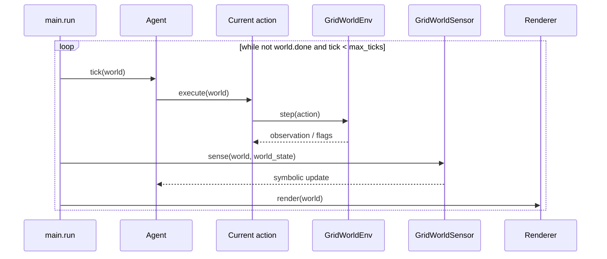

# Execution, sensors, and visualization

## Composition root

`main.py` connects all example components:

```python
env = GridWorldEnv(config)
env.reset(seed=42)

world_state = WorldState()
domain = build_grid_world_domain(env)
strategy = DepthFirstSearchStrategy()
planning_tasks = domain.tasks.copy()
planner = Planner(domain, world_state, strategy)
agent = Agent(planner, world_state, planning_tasks)
world = GridWorld(env, world_state, agent)

sensor_system = SensorSystem()
sensor_system.add_sensor(GridWorldSensor())
sensor_system.on_world_state_changed.add_handler(agent.handle_world_state_change)
sensor_system.update(world, world_state)
```

The first `update()` call is essential: it seeds `WorldState` before the `Agent` requests a plan. The example explicitly selects `DepthFirstSearchStrategy`, so feasible methods retain their domain declaration order, and copies the domain root tasks for the agent's persistent planning objective.

## Simulation loop



The tick limit protects the demonstration against unsolvable scenarios or domain bugs. The `Agent.tick()` result can be used to record the plan, status, and remaining tasks.

## Facts published by the sensor

`GridWorldSensor` publishes entity coordinates and derived predicates:

| Position facts       | State facts                    | Derived predicates             |
|----------------------|--------------------------------|--------------------------------|
| `agent_x`, `agent_y` | `has_key`, `door_open`, `done` | `at_key`, `at_door`, `at_goal` |
| `key_x`, `key_y`     |                                |                                |
| `door_x`, `door_y`   |                                |                                |
| `goal_x`, `goal_y`   |                                |                                |

The domain depends on these names. When adapting the example, update the sensor and preconditions/effects together; changing only one side makes the plan impossible or incorrect.

## Rendering and GIF

`GridWorldRenderer` composes panels that read only the frozen view models in
`core/view/models.py`. No panel imports the environment, the agent, the domain,
or numpy, which is what lets the objective panel reserve space for preference
weights and vector values before any learner exists.

| Panel                 | Shows                                                              |
|-----------------------|--------------------------------------------------------------------|
| `GridPanel`           | Tiles, the planned route, the current target, and a legend         |
| `PlanPanel`           | The whole plan, with each task marked done, executing, or pending  |
| `DecompositionPanel`  | Domain decomposition with applicable and rejected methods          |
| `ObjectivePanel`      | `[time, energy, safety]` reward, return, weights, and `WᵀQ`        |

The plan panel keeps finished tasks rather than dropping them, so a frame shows
what the episode accomplished and not only what is left. A plan taller than the
panel scrolls to follow the executing task, announcing how many tasks fall
outside the window. The executing task carries the outcome of the tick in its
colour, which is why no separate status line is drawn.

Builders sit between the runtime and the panels: `GridViewBuilder` accepts
optional cost and risk sources, and `DecompositionViewBuilder` annotates each
method with the preconditions that fail.

!!! warning "Method applicability is evaluated at the observed state"
    The planner filters methods before handing them to a selection strategy, so
    a rejected method is not observable from outside. The panel therefore
    evaluates preconditions against the observed `WorldState` rather than the
    hypothetical planning state held at each node. The two coincide at the root
    of the current domains but can diverge deeper in a decomposition.

`GridWorldTheme` owns the glyphs, the cell styles, and the terminal theme used
when exporting SVG, all derived from one `Palette` — so terminal output,
exported frames, and the GIF cannot drift apart. Two palettes are available,
matching the dissertation and the ERAMIA article figures.

`SvgFrameExporter` writes one SVG per tick and `GifBuilder` rasterizes them with
`resvg_py` and Pillow. The console has a fixed size, so every frame shares the
same dimensions. Artifacts go to `out/grid_world/<variant>/`.

## How to run

With the environment synchronized, run either example from the project root:

```bash
uv run python -m htn._examples.grid_world.single_objective.main
```

```bash
uv run python -m htn._examples.grid_world.multi_objective.main
```

Both accept `--theme dissertation|eramia`, `--seed`, and `--no-gif`. The
multi-objective example also accepts `--display-weights TIME ENERGY SAFETY`,
which fills the preference row for a figure only: no learner consumes it and no
method selection depends on it.

If the layout, seed, or initial door state changes, rebuild the `Domain` after `env.reset()`, because it uses the environment's concrete positions to create symbolic effects.
