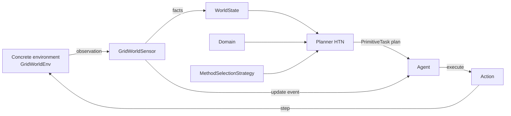

# HTN GridWorld

This documentation describes the **Hierarchical Task Network (HTN)** framework in `src/htn` and its executable GridWorld example. It makes the boundary between symbolic planning, environment execution, and state observation explicit.

## Start here

- Read the [framework overview](framework/overview.md) to understand the components and complete flow.
- See the [domain and state model](framework/model.md) to build tasks, methods, preconditions, and effects.
- Use the [planner and agent guide](framework/planning-runtime.md) to understand method-selection strategies, backtracking, validation, and replanning.
- Follow [GridWorld](grid-world/overview.md) to run and adapt the example.

## Architecture at a glance



## Research direction

The [proposed HTN–MORL architecture](architecture/symbolic-morl.md) adds vector
value learning during symbolic planning and empirical correction after real
execution. Sensors supply the initial observed state; later planning states are
hypothetical copies advanced by primitive effects. The initial proposed
objectives are time, energy consumption, and safety exposure. These learning
features are not implemented in the current symbolic baseline.

See the [proposed reward contracts](framework/extensions.md#proposed-reward-and-experience-contracts)
and [GridWorld progression](grid-world/overview.md#proposed-experimental-progression).

## Installation and prerequisites

The project requires Python 3.12 or later. With `uv`, install the dependencies already declared by the project:

```bash
uv sync
```

To generate this documentation locally, install the theme and generator (for example, in the development environment):

```bash
uv sync --group docs
uv run mkdocs serve
```

The local server provides live preview; for a static version, use `uv run mkdocs build`.

!!! note "Current scope"
    The repository also contains GOAP sketches, but the working framework documented here is the `htn` module and its GridWorld example.
