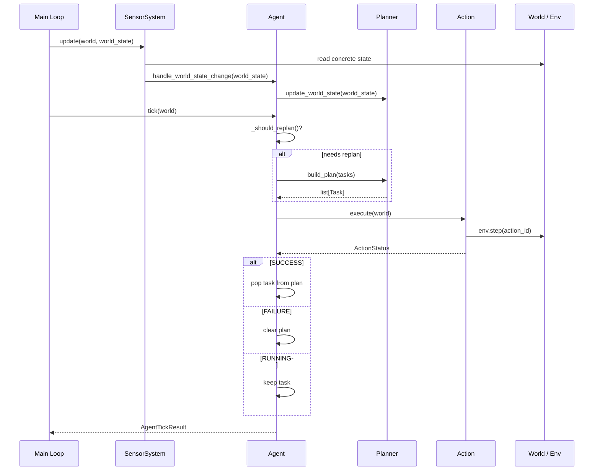
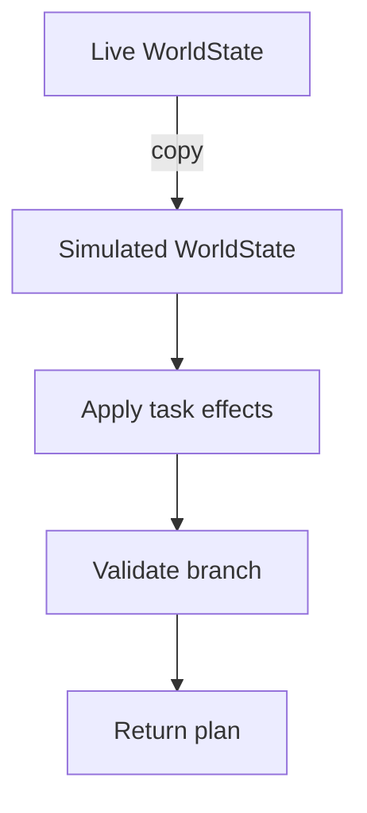

# HTN Module

Standalone implementation of a **Hierarchical Task Network** planner with a sensor-driven runtime, multi-tick action execution, and a working GridWorld example.

---

## Documentation

Run these commands from the repository root to preview the MkDocs site locally:

```bash
uv sync --group docs
uv run --group docs mkdocs serve
```

Open `http://127.0.0.1:8000` in a browser. The server reloads when documentation files change.

To produce a static site and validate the documentation build:

```bash
uv run --group docs mkdocs build --strict
```

The generated site is written to `site/`.

---

## Current Implementation

The `htn` module currently implements:

- world state representation;
- condition checking and effect application;
- primitive and compound tasks;
- methods for task decomposition;
- domain task container;
- recursive HTN planner with method-level backtracking;
- pluggable DFS and heuristic feasible-method ordering, plus an RL extension point;
- simulated world state during planning;
- abstract action interface with `ActionStatus` (`RUNNING`, `SUCCESS`, `FAILURE`);
- multi-tick action execution;
- agent tick loop with lazy replanning;
- forward plan validation before replanning;
- generic `Sensor` and `SensorSystem` abstractions;
- generic `Pathfinder[NodeT, ContextT]` abstraction;
- abstract `World` base class;
- `GymWorld` abstract base for Gymnasium-backed environments;
- multicast delegate for event-driven state notifications;
- GridWorld example with BFS pathfinding and Rich terminal renderer.

## Current Project State

The HTN runtime and GridWorld baseline are usable now. The agent receives
symbolic facts from sensors, builds a valid HTN decomposition with simulated
state and backtracking, executes primitive tasks over multiple ticks, and
replans only when its remaining plan is no longer valid.

The research architecture documented in the repository remains ahead of the
implementation. The runtime provides strategy hooks that order feasible HTN
methods, including an RL extension point for a concrete strategy, but MORL
training, vector rewards, and preference encoders remain proposed next steps.
The existing baseline will be reused as the symbolic validity filter and
execution foundation for those experiments.

---

## Module Structure

```text
src/htn/
|-- actions/
|   |-- action.py
|   `-- action_status.py
|-- agent/
|   `-- agent.py
|-- delegates/
|   `-- multicast_delegate.py
|-- pathfinding/
|   `-- pathfinder.py
|-- planner/
|   `-- planner.py
|-- strategy/
|   |-- depth_first_search_strategy.py
|   |-- heuristic_based_search_strategy.py
|   |-- method_selection_strategy.py
|   `-- rl_based_search_strategy.py
|-- sensors/
|   |-- sensor.py
|   `-- sensor_system.py
|-- tasks/
|   |-- domains/
|   |   `-- domain.py
|   `-- types/
|       |-- compound_task.py
|       |-- effects.py
|       |-- method.py
|       |-- preconditions.py
|       |-- primitive_task.py
|       `-- task.py
|-- world/
|   |-- gym/
|   |   `-- gym_world.py
|   |-- state.py
|   `-- world.py
|-- _examples/
|   `-- grid_world/
|       |-- actions.py
|       |-- domain.py
|       |-- env.py
|       |-- main.py
|       |-- movement.py
|       |-- pathfinder.py
|       |-- renderer.py
|       `-- sensors.py
`-- utils.py
```

---

# Core Concepts

## WorldState

`WorldState` stores the current symbolic state of the world as named key-value pairs.

```python
world_state.set_state("has_key", True)
world_state.set_state("door_open", False)
world_state.set_state("energy", 10)
```

Internally the state is stored as:

```python
dict[str, WorldValue]  # WorldValue = bool | int | float | str
```

Provided methods:

```python
get_state(key) -> WorldValue | None
set_state(key, value) -> None
copy() -> WorldState
```

The planner uses `copy()` to simulate planning without mutating the live world state.

---

## Task

`Task` is the abstract base class for all HTN tasks.

```text
Task
|-- PrimitiveTask
`-- CompoundTask
```

Each task has a `name`.

---

## PrimitiveTask

A `PrimitiveTask` is an executable leaf task containing an `Action`, optional `Preconditions`, and optional `Effects`.

```python
PrimitiveTask(
    name="open_door",
    action=OpenDoorAction(),
    preconditions={
        "has_key": ("=", True),
        "door_open": ("=", False),
    },
    effects={
        "door_open": ("=", True),
    },
)
```

If `preconditions` or `effects` are omitted, they default to an empty dictionary.

Provided methods:

```python
get_action() -> Action
get_preconditions() -> Preconditions
get_effects() -> Effects
check_preconditions(world_state) -> bool
apply_effects(world_state) -> None
```

---

## CompoundTask

A `CompoundTask` is a high-level task that must be decomposed into subtasks via one of its `Method` objects.

```python
CompoundTask(
    name="enter_room",
    methods=[use_key_method, force_door_method],
)
```

Provided methods:

```python
get_methods() -> list[Method]
get_method(index) -> Method
get_feasible_methods(world_state) -> list[Method]
```

`get_feasible_methods()` returns only the methods whose preconditions are satisfied by the current world state.

---

## Method

A `Method` represents one possible decomposition of a compound task.

```python
Method(
    id="enter_room.with_key",
    name="Enter room with key",
    preconditions={"has_key": ("=", True)},
    tasks=[go_to_door, open_door, enter_room],
)
```

Methods can have an empty task list as a no-op branch:

```python
Method(
    id="ensure_has_key.already_has_key",
    name="Already has key",
    preconditions={"has_key": ("=", True)},
    tasks=[],  # key is already held
)
```

Provided methods:

```python
get_task(index) -> Task
get_tasks() -> list[Task]
get_preconditions() -> Preconditions
```

---

## Preconditions

```python
Preconditions = dict[str, tuple[ConditionOperator, WorldValue]]
```

Supported operators: `=`, `!=`, `>`, `<`, `>=`, `<=`

```python
preconditions = {
    "has_key": ("=", True),
    "energy": (">=", 5),
}
```

If a required key is missing from the world state, the precondition fails. Numeric comparison operators raise `ValueError` when used with non-numeric values.

---

## Effects

```python
Effects = dict[str, tuple[EffectOperator, WorldValue]]
```

Supported operators: `=`, `+`, `-`, `*`, `/`, `%`, `//`, `**`, `not`

```python
effects = {
    "door_open": ("=", True),
    "energy": ("-", 2),
}
```

During planning, effects are applied only to copied world states. The live state is not mutated by the planner.

Non-assignment effects require the target key to already exist. Arithmetic effects require numeric values, and `not` requires a boolean value.

---

## ActionStatus

Actions return a status to support multi-tick execution:

```python
class ActionStatus(Enum):
    RUNNING = "running"  # action still in progress
    SUCCESS = "success"  # action completed successfully
    FAILURE = "failure"  # action failed
```

---

## Action

`Action` is an abstract base class. Concrete actions implement:

```python
def execute(self, world: World) -> ActionStatus:
    ...
```

The planner never executes actions. Actions are stored inside `PrimitiveTask` and executed by the `Agent` during the tick loop.

---

## World

`World` is an abstract base class. It carries the shared runtime context that actions receive when executed.

```python
class World(ABC):
    world_state: WorldState
    agent: Agent
```

Concrete subclasses extend this with environment-specific state. `World` uses `TYPE_CHECKING` to import `Agent`, avoiding a runtime circular dependency.

---

## Sensor

`Sensor[WorldT]` is a generic abstract base class. A sensor reads concrete runtime data from the world and writes symbolic facts into `WorldState`.

```python
class Sensor(ABC, Generic[WorldT]):
    @abstractmethod
    def sense(self, world: WorldT, world_state: WorldState) -> None: ...
```

Sensors only observe. They do not plan and do not execute actions.

---

## SensorSystem

`SensorSystem[WorldT]` coordinates one or more sensors and fires a delegate after the symbolic state is refreshed.

```python
sensor_system = SensorSystem()
sensor_system.add_sensor(MyEnvSensor())
sensor_system.on_world_state_changed.add_handler(agent.handle_world_state_change)

# each frame:
sensor_system.update(world, world_state)
```

`on_world_state_changed` is a `MulticastDelegate` that notifies all listeners after every sensor pass.

---

## Pathfinder

`Pathfinder[NodeT, ContextT]` is a generic abstract base class for pathfinding algorithms.

```python
class Pathfinder(ABC, Generic[NodeT, ContextT]):
    @abstractmethod
    def find_path(self, start: NodeT, goal: NodeT, context: ContextT) -> list[NodeT]: ...
```

`NodeT` is the node type, such as `tuple[int, int]` for grids. `ContextT` carries algorithm-specific data, such as grid bounds, blocked tiles, graph adjacency, or navmesh data.

---

## GymWorld

`GymWorld` extends `World` with a live `gymnasium.Env` reference, allowing actions to call `env.step()` directly.

```python
class GymWorld(World):
    env: gym.Env
    last_obs: object
    last_reward: float
    done: bool

    @abstractmethod
    def update_from_obs(self, obs: object) -> None: ...
```

`update_from_obs()` is abstract, so subclasses must implement the observation-to-`WorldState` mapping.

---

# Planner

The `Planner` decomposes domain tasks into an ordered list of executable tasks.

```python
strategy = DepthFirstSearchStrategy()
planner = Planner(domain, world_state, strategy)
plan = planner.build_plan(domain.tasks)  # -> PlanningResult | None
```

The planner owns:

```python
domain: Domain
_current_plan: PlanningResult | None  # last result, kept for representation
world_state_copy: WorldState          # snapshot used during planning
_strategy: MethodSelectionStrategy    # orders feasible methods
```

`build_plan(tasks)` returns a fresh `PlanningResult` each call. If a later root
task fails, it returns the successfully planned prefix; it returns `None` when
the first task cannot produce a primitive task. Runtime execution state is owned
by the `Agent`.

```python
@dataclass(frozen=True, slots=True)
class PlanningResult:
    tasks: list[Task]
    world_state: WorldState
    decompositions: list[MethodDecomposition]
```

`decompositions` records every method the planner applied, with the plan span it
produced and its nesting depth. A method that expands to no task is recorded as
a zero-width span, so a no-op branch remains visible in a flat plan.

---

## Recursive Planning

```python
recursive_planning(
    branch: PlanningResult,
    task: Task,
    depth: int = 0,
) -> PlanningResult | None
```

**Primitive task:** checks preconditions, appends task, applies effects to a simulated copy, and returns the updated branch.

**Compound task:** gets feasible methods, orders them through the configured
strategy, recursively plans all subtasks, records the applied method, and
returns on first success. It performs method-level backtracking if a subtask
fails.

Because `PlanningResult` is immutable and every extension builds a new one, a
failed method leaves the branch it started from untouched, records included.

```text
CompoundTask
|-- Method A  -> fails midway -> discarded
|-- Method B  -> all subtasks succeed -> returned
`-- Method C  -> never tried
```

If no method or primitive branch can be planned, the planner prints a diagnostic message and returns `None` for that branch.

---

## World State Update

```python
def update_world_state(self, world_state: WorldState) -> None:
    self.world_state_copy = world_state.copy()
    self._current_plan = []
```

Called by the agent when the sensor system fires. This refreshes the planner's snapshot and clears the planner's internal `_current_plan` field. The active runtime plan is not stored in the planner, so it is not discarded here; the agent decides whether its own `plan` should continue or be rebuilt.

---

# Agent

The `Agent` owns the current plan and drives the execution loop.

```python
agent = Agent(planner, world_state, domain.tasks.copy())
```

The agent owns:

```python
planner: Planner
world_state: WorldState   # last known symbolic state
tasks: list[Task]         # copied root-task sequence for replanning
_plan: ExecutablePlan     # tasks, decomposition record, and execution cursor
```

`plan` is a read-only view of the tasks still pending:

```python
@property
def plan(self) -> list[Task]:
    return self._plan.remaining_tasks
```

`ExecutablePlan` keeps executed tasks in the list and tracks progress with a
cursor, because the recorded decomposition spans index that list. Removing
entries would shift every span out of alignment.

---

## Tick Loop

```python
result: AgentTickResult = agent.tick(world)
```

Each tick the agent:

1. checks whether to replan (`_should_replan()`);
2. executes the current primitive task via `action.execute(world)`;
3. on `SUCCESS`, advances the cursor past the task;
4. on `FAILURE`, clears the entire plan;
5. on `RUNNING`, keeps the task at the front for the next tick.

If a non-primitive task is found in the runtime plan, the agent skips it and returns an explanatory `AgentTickResult`. In normal operation `Planner.build_plan(tasks)` returns primitive tasks only.

---

## AgentTickResult

```python
@dataclass(frozen=True, slots=True)
class AgentTickResult:
    task_name: str | None
    status: ActionStatus | None
    replanned: bool
    planned_tasks: list[str]   # names from the new plan, if replanned
    remaining_plan: list[str]  # names still pending after this tick
    message: str | None = None
```

---

## Replanning Logic

The agent replans lazily: only when there is no plan, or when the world state has changed and the current plan is no longer valid.

```python
def _should_replan(self) -> bool:
    if not self.plan:
        return True

    validation = validate_plan(
        self.plan,
        self._plan.remaining_decompositions,
        self.world_state,
    )
    violation = validation.violation

    if violation is None:
        return False

    if violation.kind is PlanViolationKind.INFEASIBLE_TASK:
        return True

    return True
```

`validate_plan()` walks the remaining plan once, carrying a simulated state, and
checks two properties. A primitive task must still satisfy its preconditions
where it executes, which answers whether the plan can run at all. Every applied
method must still satisfy its preconditions where its compound task started
decomposing, which answers whether the chosen branch still applies. Carrying the
simulated state forward lets a later task depend on an effect produced by an
earlier one still in the plan.

The first violation is returned with its kind, its plan position, the simulated
state reaching that position, and the compound task to decompose again.

---

## World State Change Handler

```python
def handle_world_state_change(self, world_state: WorldState) -> None:
    self.world_state = world_state.copy()
    self.planner.update_world_state(world_state)
```

Registered as a listener on `SensorSystem.on_world_state_changed`. The agent plan is not discarded immediately; it is validated on the next tick.

---

# Runtime Flow



---

# GridWorld Example

The `_examples/grid_world` package is a complete working example of the HTN runtime.

<table>
  <tr>
    <td valign="top">
      The GIF is generated by <code>gif_generator.py</code> after the example
      runs. It records the current end-to-end behavior: symbolic sensing, HTN
      planning, multi-tick navigation, key collection, door opening, and goal
      completion.<br><br>
      The runnable configuration is reproducible and intentionally exercises
      the full key → door → goal sequence used by the current HTN baseline.
    </td>
    <td valign="middle" align="center" width="50%">
      
    </td>
  </tr>
</table>

## Scenario

The domain models an agent that can navigate a configurable grid, collect a key, open a door, and reach a goal tile.

The reusable `GridWorldConfig` default is a deterministic 3x3 layout:

```text
A . K
. X .
G . D

A = Agent      K = Key      D = Door (locked)
O = Door open  G = Goal     X = Obstacle
```

The runnable example in `main.py` overrides this with a reproducible 10x10
layout, fixed obstacles at `(2, 2)` and `(3, 2)`, ten random obstacles, seed
`42`, and `initial_door_open=False`. This configuration exercises the full
key -> door -> goal chain shown in the GIF.

## Components

**`GridWorldEnv`** - custom `gym.Env` with 6 actions (`UP`, `RIGHT`, `DOWN`, `LEFT`, `PICKUP_KEY`, `OPEN_DOOR`). Layout is resolved at `reset()` with optional randomization.

**`GridWorld`** - `World` adapter. `done` is a property delegating to `env.done`.

**`GridContext` + `GridPathfinder`** - `GridContext(frozen=True, blocked=frozenset)` carries grid bounds and blocked positions. `GridPathfinder` implements `Pathfinder[Position, GridContext]` with BFS.

**`NavigateToPositionAction`** - reactive multi-tick navigation. Each tick it recomputes a BFS path and moves one step, returning `RUNNING` until the target is reached, `SUCCESS` when already at or after reaching the target, and `FAILURE` when no next step is available.

**`PickupKeyAction`** - calls `env.step(GridWorldEnv.ACTION_PICKUP_KEY)` and succeeds when `env.has_key` becomes true.

**`OpenDoorAction`** - calls `env.step(GridWorldEnv.ACTION_OPEN_DOOR)` and succeeds when `env.door_open` becomes true.

**`GridWorldSensor`** - maps concrete `GridWorldEnv` state to symbolic `WorldState` facts (`agent_x`, `agent_y`, `key_x`, `key_y`, `door_x`, `door_y`, `goal_x`, `goal_y`, `has_key`, `door_open`, `done`, `at_key`, `at_door`, `at_goal`).

**`RichGridWorldRenderer`** - terminal renderer using Rich. Accepts any `GridWorldLike` Protocol, decoupled from the concrete env class.

## Domain

```text
escape_grid (CompoundTask)
|-- Method [done=False, door_open=True]
|   `-- go_to_goal
`-- Method [done=False, door_open=False]
    |-- ensure_has_key (CompoundTask)
    |   |-- Method [has_key=True]  -> no-op
    |   `-- Method [has_key=False] -> go_to_key -> pickup_key
    |-- ensure_door_open (CompoundTask)
    |   |-- Method [door_open=True] -> no-op
    |   `-- Method [door_open=False, has_key=True] -> go_to_door -> open_door
    `-- go_to_goal
```

## Composition Root

```python
# main.py
config = GridWorldConfig(
    width=8,
    height=6,
    start_position=None,
    key_position=None,
    door_position=None,
    goal_position=None,
    fixed_obstacles=frozenset({(2, 2), (3, 2)}),
    random_obstacle_count=5,
    initial_has_key=False,
    initial_door_open=True,
)

env = GridWorldEnv(config)
env.reset(seed=42)

world_state = WorldState()
domain = build_grid_world_domain(env)
strategy = DepthFirstSearchStrategy()
planning_tasks = domain.tasks.copy()
planner = Planner(domain, world_state, strategy)
agent = Agent(planner, world_state, planning_tasks)
world = GridWorld(env, world_state, agent)

sensor_system = SensorSystem()
sensor_system.add_sensor(GridWorldSensor())
sensor_system.on_world_state_changed.add_handler(agent.handle_world_state_change)

sensor_system.update(world, world_state)  # seed initial symbolic state

while not world.done and tick < max_ticks:
    result = agent.tick(world)
    sensor_system.update(world, world_state)
```

---

# Important Design Details

## Planner never mutates live state

The planner operates on a copy of the world state. Effects are simulated forward during planning without touching the real environment.



## Sensor is the runtime writer of WorldState

Actions interact with the concrete environment (`env.step()`). The sensor reads the environment afterwards and writes symbolic facts. The planner reads those facts. This keeps the symbolic layer clean.

```text
Action -> env.step() -> Sensor.sense() -> WorldState -> Planner
```

`WorldState` itself is a general mutable container, so code can seed or test it directly. In the normal runtime flow, sensor updates are the source of truth.

## Agent validates before discarding plans

When the world state changes, the agent does not immediately replan. It simulates the remaining plan forward first. If preconditions still hold after applying cumulative effects, the plan continues unchanged.

---

# Current Limitations

The `htn` module does not yet implement:

- resource reservation;
- multi-agent concurrency control;
- automated test suite.
